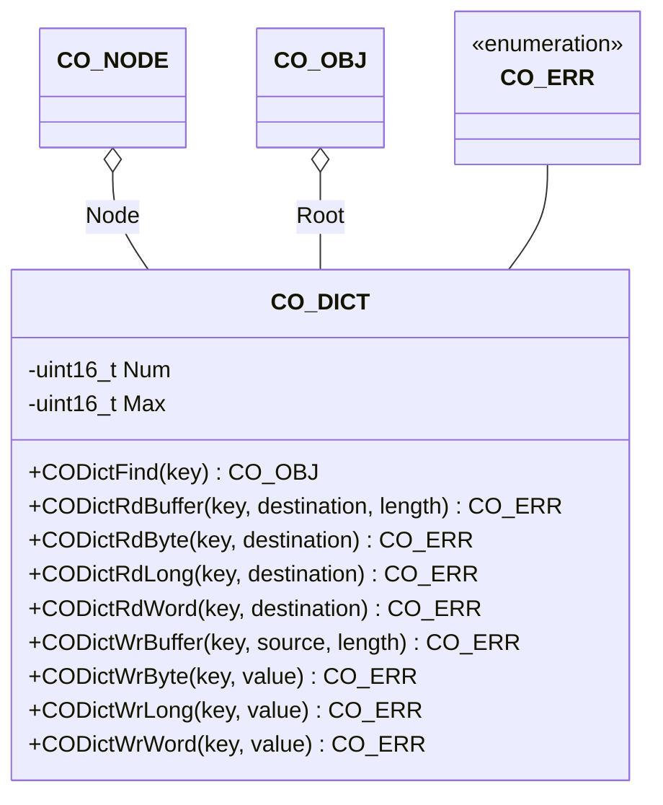

The object dictionary component provides the interface to object entries in the object dictionary.

## Structure

### Data

The class `CO_DICT` is defined within `co_dict.h` and is responsible for the object dictionary handling functions. The following data members are allocated in this class:

| Data Member | Type | Description |
| --- | --- | --- |
| Node | `CO_NODE*` | pointer to parent node |
| Root | `CO_OBJ*` | pointer to the first object in object dictionary |
| Num | `uint16_t` | current number of objects in dictionary |
| Max | `uint16_t` | maximum number of objects in dictionary |

**Note:** The data within this structure must never be manipulated without the corresponding class member functions. This can lead to unpredictable behavior of the node.
{:.info}

### Functions

**Attention:** The access with the member functions of this class to an object entry must be done with the correct width. There is no casting of the object entry values to the requested value types.
{:.warning}

The following table describes the API functions of the object dictionary module. These functions are implemented within the source file: `co_dict.c/h`

