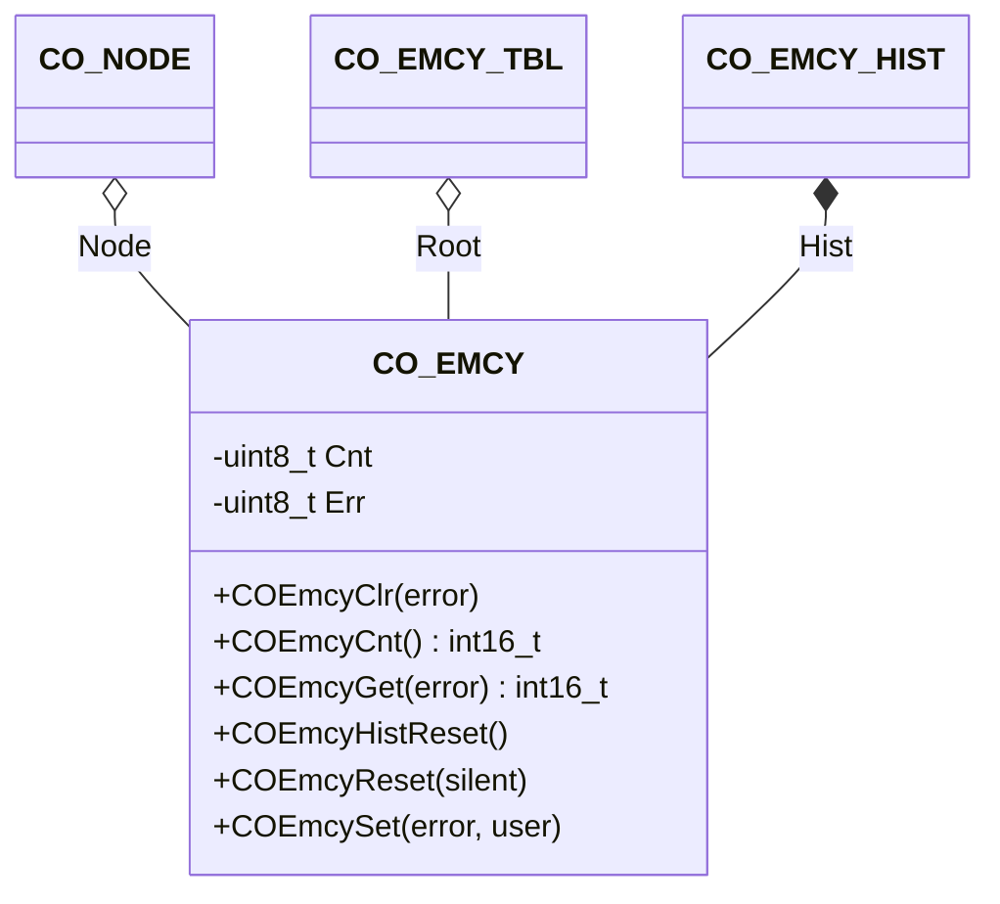

The emergency component provides an interface to the emergency history in the object dictionary and handles the emergency message transmission to the CANopen network.

## Structure

### Data

The class `CO_EMCY` is defined within `co_emcy.h` and is responsible for emergency management functions. The following data members are in this class:

| Data Member | Type | Description |
| --- | --- | --- |
| Node | `CO_NODE*` | pointer to parent node |
| Root | `CO_EMCY_TBL*` | pointer to application emergency table |
| Hist | `CO_EMCY_HIST` | emergency history management object |
| Cnt[] | `uint8_t` | error register object entry bit counters |
| Err[] | `uint8_t` | individual emergency status storage |

**Note:** The data within this structure must never be manipulated without the corresponding class member functions. This can lead to unpredictable behavior of the node.
{:.info}

### Functions

The following table describes the API functions of the emergency module. These functions are implemented within the source file: `co_emcy.c/h`

