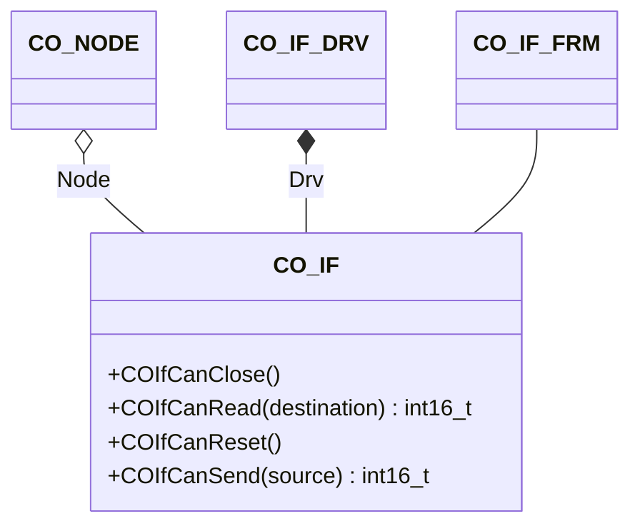

The interface component provides an interface to the hardware driver.

## Structure

### Data

The class `CO_IF` is defined within `co_if.h` and is responsible for the interface management. The following data members are in this class

| Data Member | Type | Description |
| --- | --- | --- |
| Node | `CO_NODE*` | pointer to parent node |
| Drv | `CO_IF_DRV` | driver specific CAN bus identification |

**Note:** The data within this structure must never be manipulated without the corresponding class member functions. This can lead to unpredictable behavior of the node.
{:.info}

### Functions

The following table describes the API functions of the CANopen interface module. These functions are implemented within the source file: `co_if.c/h`

