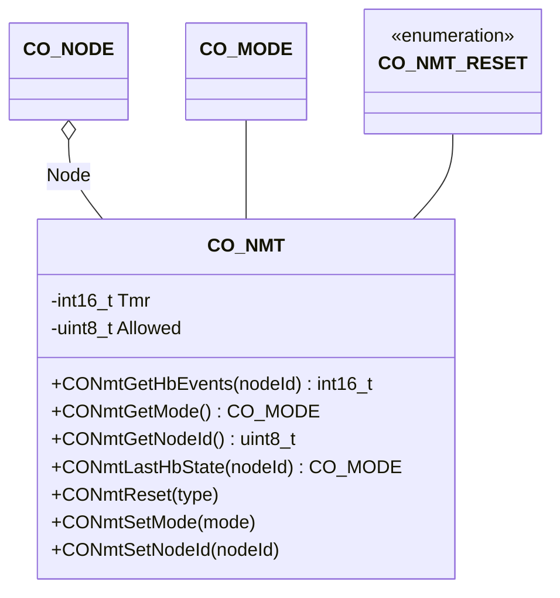

The network component provides an interface to the CANopen mode control, the node management, and the heartbeat handling.

## Structure

### Data

The class `CO_NMT` is defined within `co_nmt.h` and is responsible for the CANopen network slave management. The following data members are in this class:

| Data Member | Type | Description |
| --- | --- | --- |
| Node | `CO_NODE*` | pointer to parent node |
| Mode | `CO_MODE` | current NMT mode |
| Tmr | `int16_t` | heartpeat producer timer identifier |
| Allowed | `uint8_t` | encoding of allowed CANopen services |

**Note:** The data within this structure must never be manipulated without the corresponding class member functions. This can lead to unpredictable behavior of the node.
{:.info}

## Functions

The following table describes the API functions of the CANopen network management module. Furthermore, this module includes the heartbeat producer and consumer. These functions are implemented within the source file: `co_nmt.c/h`, `co_hbprod.c/h` and `co_hbcons.c/h`

