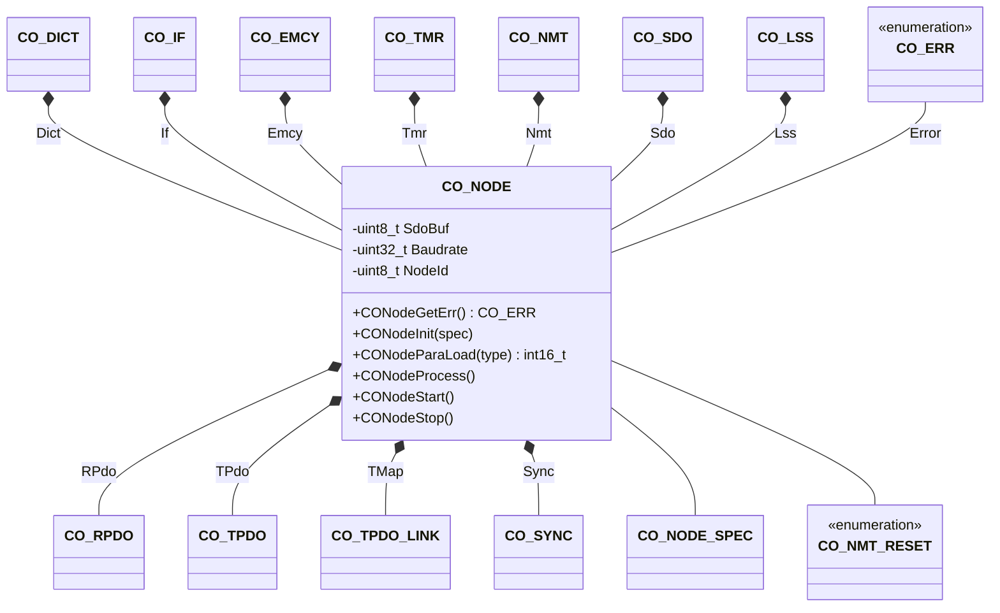

<div class="article__content" markdown="1">

The node component is the central component and includes all other components for a single CANopen node. The node component provides the interface to the node lifecycle operations.

## Structure



### Data

The class `CO_NODE` is defined within `co_core.h` and is responsible for the overall node management functions. The node is the central data point of a CANopen device. The following data members are in this class:

| Data Member | Type | Description |
| --- | --- | --- |
| Dict | `CO_DICT` | object dictionary object |
| If | `CO_IF` | CAN bus interface object |
| Emcy | `CO_EMCY` | node emergency object |
| Tmr | `CO_TMR` | timer manager object |
| Nmt | `CO_NMT` | node network management object |
| Sdo | `CO_SDO` | SDO server object array |
| SdoBuf | `uint8_t*` | pointer to SDO transfer buffer |
| RPdo[] | `CO_RPDO` | receive PDO object array |
| TPdo[] | `CO_TPDO` | transmit PDO object array |
| TMap[] | `CO_TPDO_LINK` | transmit PDO mapping link array |
| Sync | `CO_SYNC` | SYNC management object |
| Lss | `CO_LSS` | LSS management object |
| Error | `CO_ERR` | Internal error indentification code |
| Baudrate | `uint32_t` | default CAN communication baudrate |
| NodeId | `uint8_t` | default CANopen node ID |

**Note:** The data within this structure must never be manipulated without the corresponding class member functions. This can lead to unpredictable behavior of the node.
{:.info}

### Functions

During calling a member function of a class, the first parameter must be a reference to a corresponding object. This should be done as shown in the following examples:

```c
    CO_NODE  AppNode;                  /* allocation of the application node    */
    :
    CONodeInit (&AppNode       ,...);  /* call member function of class CO_NODE */
    CODirFind  (&(AppNode.Dir) ,...);  /* call member function of class CO_DIR  */
    COIfCanSend(&(AppNode.If)  ,...);  /* call member function of class CO_IF   */
    COEmcySet  (&(AppNode.Emcy),...);  /* call member function of class CO_EMCY */
    COTmrCreate(&(AppNode.Tmr) ,...);  /* call member function of class CO_TMR  */
    CONmtReset (&(AppNode.Nmt) ,...);  /* call member function of class CO_NMT  */
    :
```

Note, that in all application source files, which needs to call one or more CANopen API functions, the header file `co_core.h` must be included.

The following table describes the API functions of the CANopen core module. These functions are implemented within the source file: `co_core.c/h`

</div>
