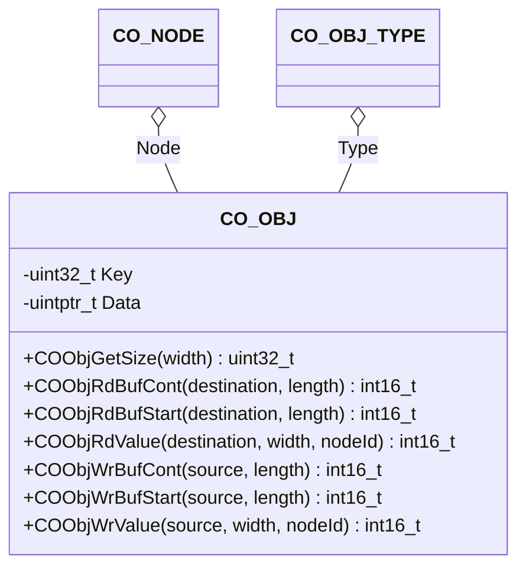

The object component provides an interface to the individual object entries.

## Structure

### Data

The class `CO_OBJ` is defined within `co_obj.h` and is responsible for the CANopen object entry data access handling. The following data members are in this class:

| Data Member | Type | Description |
| --- | --- | --- |
| Key | `uint32_t` | Encoded object entry properties: index, subindex, external access mode, PDO mappable, type of object entry, consideration of node ID and data storage information |
| Type | `CO_OBJ_TYPE*` | pointer to object type |
| Data | `uintptr_t` | data information of object entry |

**Note:** The data within this structure must never be manipulated without the corresponding class member functions. This can lead to unpredictable behavior of the node.
{:.info}

### Functions

The following table describes the API functions of the CANopen object entry module. These functions are implemented within the source file: `co_obj.c/h`

