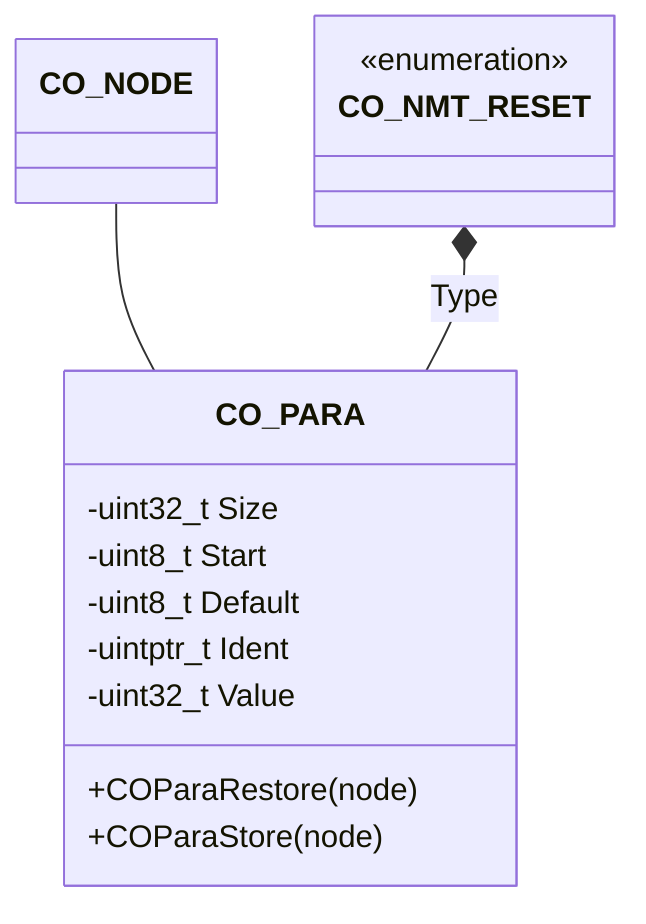

The parameter component provides an interface to the parameter group handling.

## Structure

### Data

The class `CO_PARA` is defined within `co_para.h` and is responsible for storing and restoring the right CANopen parameter groups in dependency to the NMT reset type. The following data members are in this class:

| Data Member | Type | Description |
| --- | --- | --- |
| Size | `uint32_t` | size of parameter memory block |
| Start | `uint8_t*` | pointer to parameter memory block |
| Default | `uint8_t*` | pointer to default parameter block |
| Type | `CO_NMT_RESET` | parameter group reset type |
| Ident | `uintptr_t*` | pointer to user identification code |
| Value | `uint32_t` | value, when reading this parameter group |

### Functions

The following table describes the API functions of the CANopen parameter module. These functions are implemented within the source file: `co_para.c/h`

