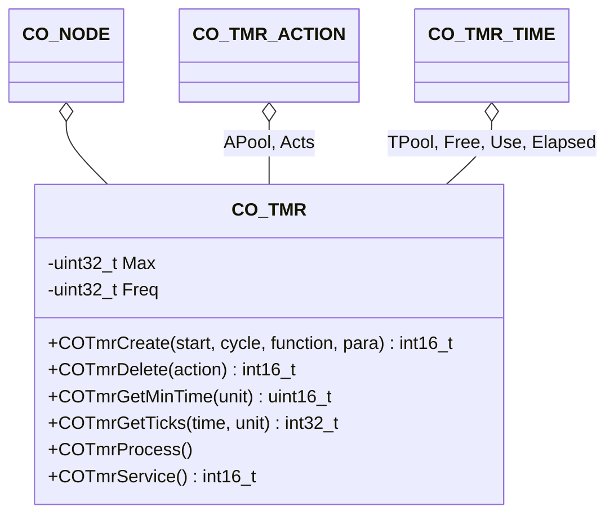

The timer component provides an interface to function executions initiated by a timer.

## Structure

### Data

The class `CO_TMR` is defined within `co_tmr.h` and is responsible for the CANopen highspeed timer management. The following data members are in this class:

| Data Member | Type | Description |
| --- | --- | --- |
| Node | `CO_NODE*` | pointer to parent node object |
| Max | `uint32_t` | maximum nunber of timed actions |
| APool[] | `CO_TMR_ACTION` | timer action pool array |
| TPool[] | `CO_TMR_TIME` | timer event pool array |
| Acts | `CO_TMR_ACTION*` | pointer to the root of free actions linked list |
| Free | `CO_TMR_TIME*` | pointer to the root of free events linked list |
| Use | `CO_TMR_TIME*` | pointer to the root of used events linked list |
| Elapsed | `CO_TMR_TIME*` | pointer to the root of elapsed timers linked list |
| Freq | `uint32_t` | timer ticks per second |

**Note:** The data within this structure must never be manipulated without the corresponding class member functions. This can lead to unpredictable behavior of the node.
{:.info}

### Functions

The following table describes the API functions of the CANopen timer module. With the listed functions we can define the execution of actions after a given time interval with or without a cycle time. The functions are implemented within the source files: `co_tmr.c/h`.

