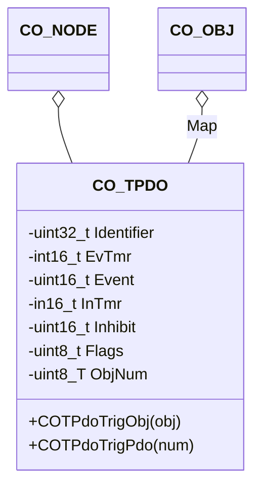

The TPDO component provides an interface to the CANopen PDO transmission triggers.

## Structure

### Data

The class `CO_TPDO` is defined within `co_tpdo.h` and is responsible for the CANopen transmit process data objects (TPDO). The following data members are in this class:

| Data Member | Type | Description |
| --- | --- | --- |
| Node | `CO_NODE*` | pointer to parent node |
| Identifier | `uint32_t` | CAN message identifier |
| Map[] | `CO_OBJ*` | pointer list to mapped object entries |
| EvTmr | `int16_t` | event timer identifier |
| Event | `uint16_t` | event time in timer ticks |
| InTmr | `int16_t` | inhibit timer identifier |
| Inhibit | `uint16_t` | inhibit timer in timer ticks |
| Flags | `uint8_t` | transmit status flags |
| ObjNum | `uint8_t` | number of mapped object entries |

**Note:** The data within this structure must never be manipulated without the corresponding class member functions. This can lead to unpredictable behavior of the node.
{:.info}

### Functions

The following table describes the API functions of the CANopen transmit PDO module. These functions are implemented within the source file: `co_tpdo.c/h`

