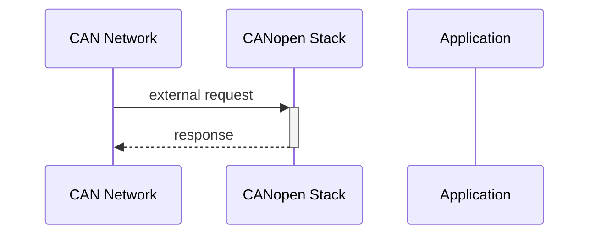
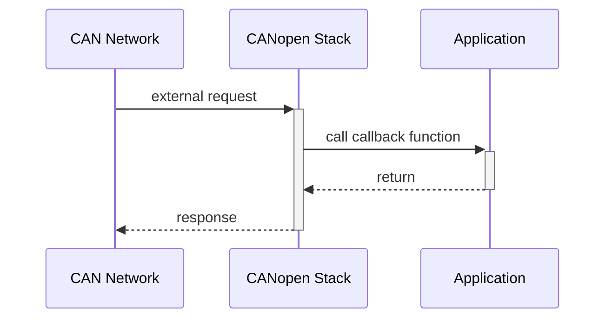
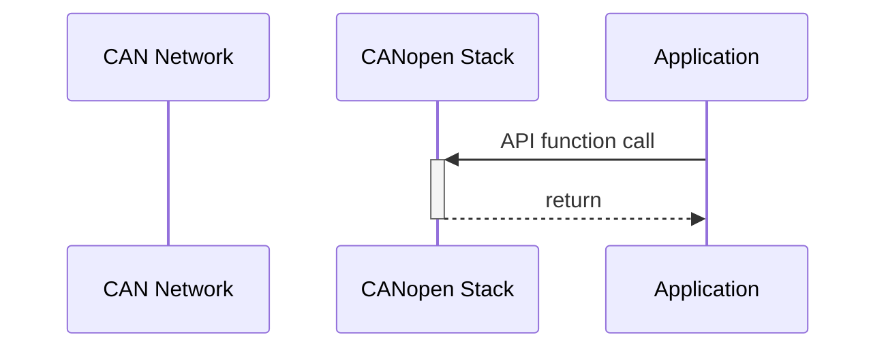

## CANopen stack actions

In the architecture we see, that the CANopen stack is the connection between the CAN network and the application. The central information store is the object dictionary which is used to control the behavior of the device, transmit and receive process data or configure runtime parameters.

In principle, all of these activities can initiated by external devices in the CAN network, or the internal CANopen application. The following chapters gives an overall of the possible scenarios.

### Autonomous external request

An *autonomous external request* is initiated by an external device and is handled by the CANopen stack according to the standard. No interaction with the application is necessary.

*An example for this type of request is the SDO access to an object entry.*

Therefore, there is nothing to do in the application. It is important to know the CANopen standard CiA-301 to know how to configure the CANopen stack responses within the object dictionary.

### External request

An *external request* is similar to the autonomous external request with the difference that the application needs to provide a callback function to realize the application-specific behavior.

*An example for this type of request is the parameter store request which uses the parameter write callback from the application.*

A list of all callback functions is documented in the [Callback Interface](/docs/usecase/callbacks).

### Internal request

An *internal request* is an API function call initiated by the application.

*An example for this type of request is the update of a value in an object entry.*

The API functions are documented in the categories within the chapter **API Functions**:

[CANopen Node](/docs/api/node) - functions used for controlling the node (init, start, stop, etc.)

[Object Dictionary](/docs/api/dictionary) - functions used for basic reading and writing in the object dictionary

[Emergency](/docs/api/emergency) - functions used to manage detected emergency errors (set, clear, etc.)

[Network Management](/docs/api/network) - functions to access the network management (set/get modes, node-ID, etc.)

[Object Entry](/docs/api/object) - functions used to read and write object entries of any type and size

[TPDO Event](/docs/api/tpdo) - triggering the transmission of TPDO via number or mapped object entries
