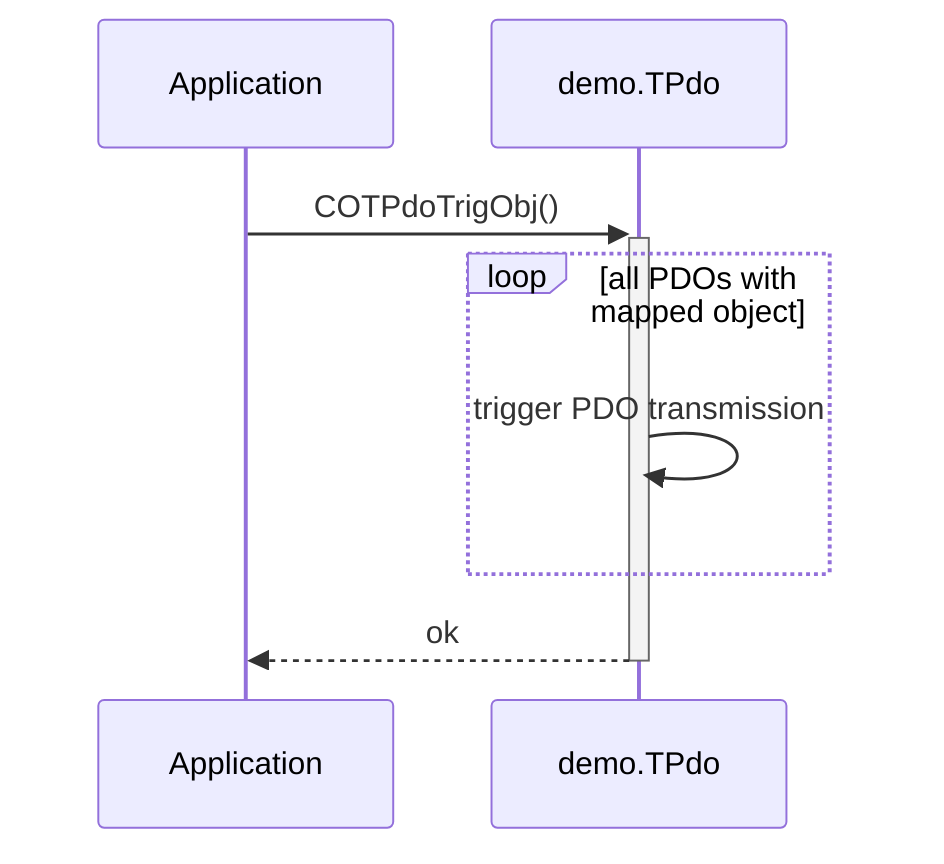

## Triggering PDO Transmission

The CANopen stack provides service functions for triggering PDO transmission on an application or profile-specific event. The timing behavior, corresponding to automatic event timer triggering, is handled within the CANopen stack with the service function group COTmr…(). For triggering the PDO transmission the service function group COTPdo…() is provided.


### Object Trigger

For triggering the transmission of all TPDOs, which has active mapping entries to a specific object directory entry, the service call is:

```c
  COTPdoTrigObj(&demo.TPdo, obj);    /* trigger PDO via object */
```

The following diagram shows the internal behavior of this service.


