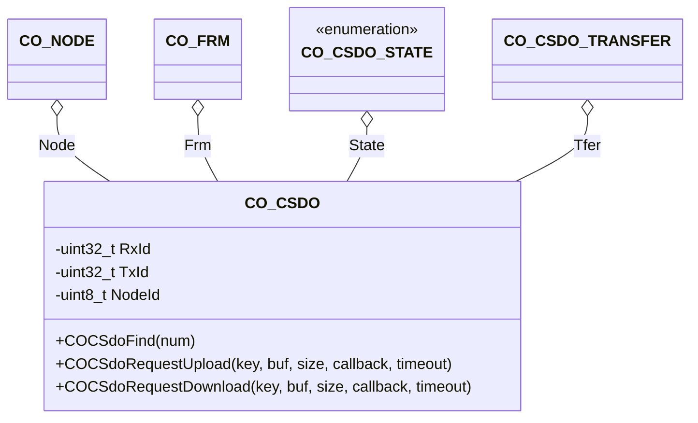

# SDO Client

The CSDO component provides an interface to the CANopen SDO client.

## Module Context



### Structure Data

The class `CO_CSDO` is defined within `co_csdo.h` and is responsible for the CANopen SDO client handling. The following data members are in this class:

| Data Member | Type       | Description                            |
| ----------- | ---------- | -------------------------------------- |
| TxId        | `uint32_t` | COB-ID for the transmitted SDO request |
| RxId        | `uint32_t` | COB-ID for the received SDO response   |
| NodeId      | `uint8_t`  | Node-Id of addressed SDO server        |

!!! info

    The data within this structure must never be manipulated without the corresponding class member functions. This can lead to unpredictable behavior of the node.

### Member Functions

The following chapters describes the API functions of the CANopen SDO client module. These functions are implemented within the source file: `co_csdo.c/h`

#### COCSdoFind()

The function checks the availability of the given SDO client index and returns the corresponding CO_CSDO object.

**Prototype**

```c
CO_CSDO *COCSdoFind(CO_NODE *node, uint8_t num);
```

**Arguments**

| Parameter | Description                    |
| --------- | ------------------------------ |
| node      | Pointer to parent CANopen node |
| num       | SDO client number (1..127)     |

**Returned Value**

- The function returns a valid CO_CSDO object when addressed SDO client is ready for initiating a new transfer. Otherwise, an invalid CO_CSDO object is returned.

**Example**

The following example checks the state of SDO client #2.

```c
CO_CSDO *csdo;
  :
csdo = COCSdoFind(&(AppNode), 2);
if (csdo == 0) {

  /* SDO client #2 is missing or busy */

} else {

  /* SDO client #2 is usable */

}
  :
```

#### COCSdoRequestDownload()

The function starts an SDO download transfer in the calling node to write data to the configured SDO server node-id.

**Prototype**

```c
CO_ERR COCSdoRequestDownload(CO_CSDO *csdo,
                             uint32_t key,
                             uint8_t *buf,
                             uint32_t size,
                             CO_CSDO_CALLBACK_T callback,
                             uint32_t timeout);
```

**Arguments**

| Parameter | Description                                       |
| --------- | ------------------------------------------------- |
| csdo      | Pointer to SDO client object                      |
| key       | destination object entry on SDO server Node-Id    |
| buf       | pointer to buffer with data                       |
| size      | size in byte of data within the buffer            |
| callback  | user provided callback for transfer finalization  |
| timeout   | transfer timeout in milliseconds                  |

**Returned Value**

- The function returns CO_ERR_NONE when transfer is initiated successfully. Any other error code indicates, that the transfer is not started.

**Example**

The following example writes a 32bit value to the remote node object dictionary entry [`1234h:02`] with SDO client #1 and a transfer timeout of 1s.

```c
uint32_t writeValue = 0;

/* The application specific SDO transfer finalization callback */
void AppCSdoFinishCb(CO_CSDO *csdo, uint16_t index, uint8_t sub, uint32_t code)
{
  if (code == 0) {

    /* data written successfully in remote node */

  } else {

    /* a timeout or abort is detected during SDO transfer  */

  }
}

/* somewhere in your application: */
void foo()
{
  CO_CSDO *csdo;
  CO_ERR   err;
    :
  csdo = COCSdoFind(&(AppNode), 1);
  writeValue = 42;
  err = COCSdoRequestDownload(csdo, CO_DEV(1234,02),
                              &writeValue, sizeof(writeValue),
                              AppCSdoFinishCb, 1000);
  if (err == CO_ERR_NONE) {

    /* Transfer is started successfully */

    /* Note: don't change the 'writeValue' until transfer is finished! */

  } else {

    /* Unable to start the SDO transfer */

  }
  :
}
```

#### COCSdoRequestUpload()

The function starts an SDO upload transfer in the calling node to read data from the configured SDO server node-id.

**Prototype**

```c
CO_ERR COCSdoRequestUpload(CO_CSDO *csdo,
                           uint32_t key,
                           uint8_t *buf,
                           uint32_t size,
                           CO_CSDO_CALLBACK_T callback,
                           uint32_t timeout);
```

**Arguments**

| Parameter | Description                                       |
| --------- | ------------------------------------------------- |
| csdo      | Pointer to SDO client object                      |
| key       | destination object entry on SDO server Node-Id    |
| buf       | pointer to buffer with data                       |
| size      | size in byte of data within the buffer            |
| callback  | user provided callback for transfer finalization  |
| timeout   | transfer timeout in milliseconds                  |

**Returned Value**

- The function returns CO_ERR_NONE when transfer is initiated successfully. Any other error code indicates, that the transfer is not started.

**Example**

The following example reads a 32bit value from the remote node object dictionary entry [`1234h:02`] with SDO client #1 and a transfer timeout of 1s.

```c
uint32_t readValue = 0;

/* The application specific SDO transfer finalization callback */
void AppCSdoFinishCb(CO_CSDO *csdo, uint16_t index, uint8_t sub, uint32_t code)
{
  if (code == 0) {

    /* read data is available in 'readValue' */

  } else {

    /* a timeout or abort is detected during SDO transfer  */

  }
}

/* somewhere in your application: */
void foo()
{
  CO_CSDO *csdo;
  CO_ERR   err;
    :
  csdo = COCSdoFind(&(AppNode), 1);
  err = COCSdoRequestUpload(csdo, CO_DEV(1234,02),
                            &readValue, sizeof(readValue),
                            AppCSdoFinishCb, 1000);
  if (err == CO_ERR_NONE) {

    /* Transfer is started successfully */

    /* Note: don't use the 'readValue' until transfer is finished! */

  } else {

    /* Unable to start the SDO transfer */

  }
  :
}
```
