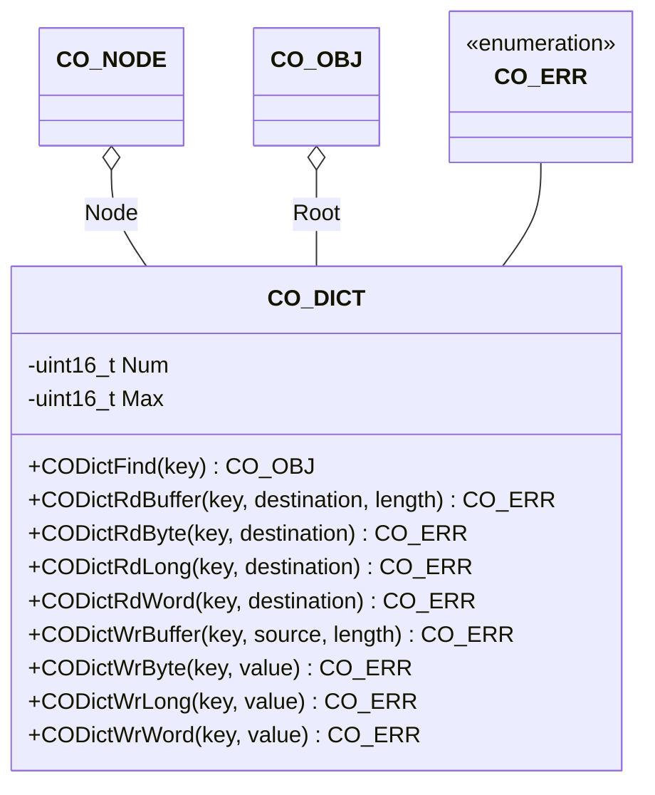

# Object Dictionary

The object dictionary component provides the interface to object entries in the object dictionary.

## Module Context



### Structure Data

The class `CO_DICT` is defined within `co_dict.h` and is responsible for the object dictionary handling functions. The following data members are allocated in this class:

| Data Member | Type       | Description                                      |
| ----------- | ---------- | ------------------------------------------------ |
| Max         | `uint16_t` | maximum number of objects in dictionary          |
| Node        | `CO_NODE*` | pointer to parent node                           |
| Num         | `uint16_t` | current number of objects in dictionary          |
| Root        | `CO_OBJ*`  | pointer to the first object in object dictionary |

!!! info

    The data within this structure must never be manipulated without the corresponding class member functions. This can lead to unpredictable behavior of the node.

### Member Functions

!!! warning

    The access with the member functions of this class to an object entry must be done with the correct width. There is no casting of the object entry values to the requested value types.

The following table describes the API functions of the object dictionary module. These functions are implemented within the source file: `co_dict.c/h`

#### CODictFind()

The function is often called from the application to get an object entry. If an object entry is not found, this generates no stack error.

**Prototype**

```c
CO_OBJ *CODictFind(CO_DICT *cod, uint32_t key);
```

**Arguments**

| Parameter | Description                                         |
| --------- | --------------------------------------------------- |
| cod       | pointer to the object dictionary                    |
| key       | object entry key; should be generated with `CO_DEV` |

**Returned Value**

- `>0` : pointer to identified object entry
- `=0` : object entry is not found

**Example**

The following example checks the existence of the mandatory object entry "[1017:00] - Heartbeat" within the object dictionary of the CANopen node AppNode.

```c
CO_OBJ *obj;
  :
obj = CODictFind(&(Appnode.Dict), CO_DEV(0x1017, 0x00));
if (obj == 0) {

  /* object [1017:00] is missing */

} else {

  /* object [1017:00] is available */

}
  :
```

!!! note

    When using a static object dictionary, you can store and reuse the pointer to the identified object entry with the [Object Entry][1] access functions. The pointer to the object entry will NOT change during runtime in a static object dictionary.

#### CODictRdBuffer()

The object entry is addressed with the given key and the bytes will be read from the dictionary and copied to the given destination buffer with the given length.

**Prototype**

```c
CO_ERR CODictRdBuffer(CO_DICT  *cod,
                      uint32_t  key,
                      uint8_t  *buffer,
                      uint32_t  length);
```

**Arguments**

| Parameter | Description                                         |
| --------- | --------------------------------------------------- |
| cod       | pointer to the object dictionary                    |
| key       | object entry key; should be generated with `CO_DEV` |
| buffer    | pointer to the destination bytes                    |
| length    | length of destination buffer in number of bytes     |

**Returned Value**

- `== CO_ERR_NONE` : successful operation
- `!= CO_ERR_NONE` : an error is detected

**Example**

The following example reads the value to the hypothetical application-specific object entry "[1234:56]" within the object dictionary of the CANopen node AppNode.

```c
CO_ERR  err;
uint8_t buffer[10];
  :
err = CODictRdBuffer(&(Appnode.Dict), CO_DEV(0x1234, 0x56), buffer, 10);
if (err != CO_ERR_NONE) {

  /* object [1234:56] is missing or error during writing */

}
  :
```

#### CODictRdByte()

The object entry is addressed with the given key and the value will be written to the given destination pointer.

**Prototype**

```c
CO_ERR CODictRdByte(CO_DICT *cod, uint32_t key, uint8_t *value);
```

**Arguments**

| Parameter | Description                                         |
| --------- | --------------------------------------------------- |
| cod       | pointer to the object dictionary                    |
| key       | object entry key; should be generated with `CO_DEV` |
| value     | pointer to value destination                        |

**Returned Value**

- `== CO_ERR_NONE` : successful operation
- `!= CO_ERR_NONE` : an error is detected

**Example**

The following example reads the current value of the hypothetical application-specific object entry "[1234:56]" within the object dictionary of the CANopen node AppNode.

```c
CO_ERR  err;
uint8_t value;
  :
err = CODictRdByte(&(Appnode.Dict), CO_DEV(0x1234, 0x56), &value);
if (err != CO_ERR_NONE) {

  /* object [1234:56] is missing or error during reading */

} else {

  /* value holds the content of object [1234:56] */

}
  :
```

!!! note

    This function uses `CODictFind()` on each function call. To improve access performance for multiple accesses to a single object entry, the application may use `CODictFind()` once and `COObjRdValue()` multiple times.

#### CODictRdLong()

The object entry is addressed with the given key and the value will be written to the given destination pointer.

**Prototype**

```c
CO_ERR CODictRdLong(CO_DICT *cod, uint32_t key, uint32_t *value);
```

**Arguments**

| Parameter | Description                                         |
| --------- | --------------------------------------------------- |
| cod       | pointer to the object dictionary                    |
| key       | object entry key; should be generated with `CO_DEV` |
| value     | pointer to value destination                        |

**Returned Value**

- `== CO_ERR_NONE` : successful operation
- `!= CO_ERR_NONE` : an error is detected

**Example**

The following example reads the current value of the hypothetical application-specific object entry "[1234:56]" within the object dictionary of the CANopen node AppNode.

```c
CO_ERR   err;
uint32_t value;
  :
err = CODictRdLong(&(Appnode.Dict), CO_DEV(0x1234, 0x56), &value);
if (err != CO_ERR_NONE) {

  /* object [1234:56] is missing or error during reading */

} else {

  /* value holds the content of object [1234:56] */

}
  :
```

!!! note

    This function uses `CODictFind()` on each function call. To improve access performance for multiple accesses to a single object entry, the application may use `CODictFind()` once and `COObjRdValue()` multiple times.

#### CODictRdWord()

The object entry is addressed with the given key and the value will be written to the given destination pointer.

**Prototype**

```c
CO_ERR CODictRdWord(CO_DICT *cod, uint32_t key, uint16_t *value);
```

**Arguments**

| Parameter | Description                                         |
| --------- | --------------------------------------------------- |
| cod       | pointer to the object dictionary                    |
| key       | object entry key; should be generated with `CO_DEV` |
| value     | pointer to value destination                        |

**Returned Value**

- `== CO_ERR_NONE` : successful operation
- `!= CO_ERR_NONE` : an error is detected

**Example**

The following example reads the current value of the hypothetical application-specific object entry "[1234:56]" within the object dictionary of the CANopen node AppNode.

```c
CO_ERR    err;
uint16_t  value;
  :
err = CODictRdWord(&(Appnode.Dict), CO_DEV(0x1234, 0x56), &value);
if (err != CO_ERR_NONE) {

  /* object [1234:56] is missing or error during reading */

} else {

  /* value holds the content of object [1234:56] */

}
  :
```

!!! note

    This function uses `CODictFind()` on each function call. To improve access performance for multiple accesses to a single object entry, the application may use `CODictFind()` once and `COObjRdValue()` multiple times.

#### CODictWrBuffer()

The object entry is addressed with the given key and the bytes will be read from to the given source buffer of the given length.

**Prototype**

```c
CO_ERR CODictWrBuffer(CO_DICT  *cod,
                      uint32_t  key,
                      uint8_t  *buffer,
                      uint32_t  length);
```

**Arguments**

| Parameter | Description                                         |
| --------- | --------------------------------------------------- |
| cod       | pointer to the object dictionary                    |
| key       | object entry key; should be generated with `CO_DEV` |
| buffer    | pointer to the source bytes                         |
| length    | length of source buffer                             |

**Returned Value**

- `== CO_ERR_NONE` : successful operation
- `!= CO_ERR_NONE` : an error is detected

**Example**

The following example writes the value to the hypothetical application-specific object entry "[1234:56]" within the object dictionary of the CANopen node AppNode.

```c
CO_ERR  err;
uint8_t buffer[10] = { 'a','b','c','d','e','f','g','h','i', 0 };
  :
err = CODictWrBuffer(&(Appnode.Dict), CO_DEV(0x1234, 0x56), buffer, 10);
if (err != CO_ERR_NONE) {

  /* object [1234:56] is missing or error during writing */

}
  :
```

#### CODictWrByte()

The object entry is addressed with the given key.

**Prototype**

```c
CO_ERR CODictWrByte(CO_DICT *cod, uint32_t key, uint8_t value);
```

**Arguments**

| Parameter | Description                                         |
| --------- | --------------------------------------------------- |
| cod       | pointer to the object dictionary                    |
| key       | object entry key; should be generated with `CO_DEV` |
| value     | the source value                                    |

**Returned Value**

- `== CO_ERR_NONE` : successful operation
- `!= CO_ERR_NONE` : an error is detected

**Example**

The following example writes the value to the hypothetical application-specific object entry "[1234:56]" within the object dictionary of the CANopen node AppNode.

```c
CO_ERR  err;
uint8_t value = 0x30;
  :
err = CODictWrByte(&(Appnode.Dict), CO_DEV(0x1234, 0x56), value);
if (err != CO_ERR_NONE) {

  /* object [1234:56] is missing or error during writing */

}
  :
```

!!! note

    This function uses `CODictFind()` on each function call. To improve access performance for multiple accesses to a single object entry, the application may use `CODictFind()` once and `COObjWrValue()` multiple times.

#### CODictWrLong()

The object entry is addressed with the given key.

**Prototype**

```c
CO_ERR CODictWrLong(CO_DICT *cod, uint32_t key, uint32_t value);
```

**Arguments**

| Parameter | Description                                         |
| --------- | --------------------------------------------------- |
| cod       | pointer to the object dictionary                    |
| key       | object entry key; should be generated with `CO_DEV` |
| value     | the source value                                    |

**Returned Value**

- `== CO_ERR_NONE` : successful operation
- `!= CO_ERR_NONE` : an error is detected

**Example**

The following example writes the value to the hypothetical application-specific object entry "[1234:56]" within the object dictionary of the CANopen node AppNode.

```c
CO_ERR   err;
uint32_t value = 0x30;
  :
err = CODictWrLong(&(Appnode.Dict), CO_DEV(0x1234, 0x56), value);
if (err != CO_ERR_NONE) {

  /* object [1234:56] is missing or error during writing */

}
  :
```

!!! note

    This function uses `CODictFind()` on each function call. To improve access performance for multiple accesses to a single object entry, the application may use `CODictFind()` once and `COObjWrValue()` multiple times.

#### CODictWrWord()

The object entry is addressed with the given key.

**Prototype**

```c
CO_ERR CODictWrWord(CO_DICT *cod, uint32_t key, uint16_t value);
```

**Arguments**

| Parameter | Description                                         |
| --------- | --------------------------------------------------- |
| cod       | pointer to the object dictionary                    |
| key       | object entry key; should be generated with `CO_DEV` |
| value     | the source value                                    |

**Returned Value**

- `== CO_ERR_NONE` : successful operation
- `!= CO_ERR_NONE` : an error is detected

**Example**

The following example writes the value to the hypothetical application-specific object entry "[1234:56]" within the object dictionary of the CANopen node AppNode.

```c
CO_ERR   err;
uint16_t value = 0x30;
  :
err = CODictWrWord(&(Appnode.Dict), CO_DEV(0x1234, 0x56), value);
if (err != CO_ERR_NONE) {

  /* object [1234:56] is missing or error during writing */

}
  :
```

!!! note

    This function uses `CODictFind()` on each function call. To improve access performance for multiple accesses to a single object entry, the application may use `CODictFind()` once and `COObjWrValue()` multiple times.


[1]: ../object
