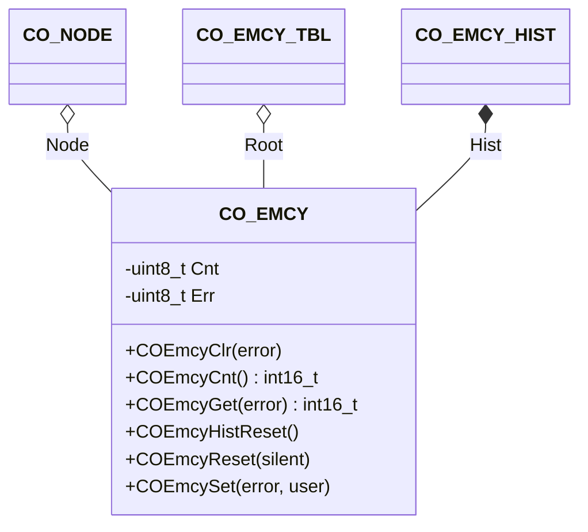

# Emergency

The emergency component provides an interface to the emergency history in the object dictionary and handles the emergency message transmission to the CANopen network.

## Module Context



### Structure Data

The class `CO_EMCY` is defined within `co_emcy.h` and is responsible for emergency management functions. The following data members are in this class:

| Data Member | Type           | Description                              |
| ----------- | -------------- | ---------------------------------------- |
| Cnt[]       | `uint8_t`      | error register object entry bit counters |
| Err[]       | `uint8_t`      | individual emergency status storage      |
| Hist        | `CO_EMCY_HIST` | emergency history management object      |
| Node        | `CO_NODE*`     | pointer to parent node                   |
| Root        | `CO_EMCY_TBL*` | pointer to application emergency table   |

!!! info

    The data within this structure must never be manipulated without the corresponding class member functions. This can lead to unpredictable behavior of the node.

### Member Functions

The following table describes the API functions of the emergency module. These functions are implemented within the source file: `co_emcy.c/h`

#### COEmcyClr()

The EMCY message is transmitted if the error was previously detected.

**Prototype**

```c
void COEmcyClr(CO_EMCY *emcy, uint8_t error);
```

**Arguments**

| Parameter | Description                                     |
| --------- | ----------------------------------------------- |
| emcy      | pointer to EMCY object                          |
| error     | error code identifier in application EMCY table |

**Returned Value**

- none

**Example**

The following example demonstrates the clearing of a possible detected emergency event APP_EMCY_2 within the application of the CANopen node AppNode.

```c
  :
COEmcyClr(&(AppNode.Emcy), APP_EMCY_2);
  :
```

!!! note

    The emergency identifier APP_EMCY_2 must be defined within the application-specific configuration.

#### COEmcyCnt()

When calling this function, all EMCY error status will stay unchanged.

**Prototype**

```c
int16_t COEmcyCnt(CO_EMCY *emcy);
```

**Arguments**

| Parameter | Description            |
| --------- | ---------------------- |
| emcy      | pointer to EMCY object |

**Returned Value**

- `>=0` : success with the number of currently detected EMCY errors
- `<0` : an error is detected inside of this function

**Example**

The following example calculates the current number of detected emergency events within the application of the CANopen node AppNode.

```c
int16_t emcy;
  :
emcy = COEmcyCnt(&(AppNode.Emcy));
if (emcy < 0) {

  /* error handling */

} else {

  /* emcy holds number of detected emergencies */

}
  :
```

#### COEmcyGet()

When calling this function, the EMCY error status will stay unchanged.

**Prototype**

```c
int16_t COEmcyGet(CO_EMCY *emcy, uint8_t error);
```

**Arguments**

| Parameter | Description                                     |
| --------- | ----------------------------------------------- |
| emcy      | pointer to EMCY object                          |
| error     | error code identifier in application EMCY table |

**Returned Value**

- `=0` : success with error is not detected
- `=1` : success with an error was detected before
- `<0` : an error is detected inside of this function

**Example**

The following example reads the current status of a possible detected emergency event APP_EMCY_2 within the application of the CANopen node AppNode.

```c
int16_t warning;
  :
warning = COEmcyGet(&(AppNode.Emcy), APP_EMCY_2);
if (warning < 0) {

  /* error handling */

} else {

  /* warning holds current emergency status */

}
  :
```

!!! note

    The emergency identifier APP_EMCY_2 must be defined within the application-specific configuration.

#### COEmcyHistReset()

There is no EMCY message transmission due to this function call.

**Prototype**

```c
void COEmcyHistReset(CO_EMCY *emcy);
```

**Arguments**

| Parameter | Description            |
| --------- | ---------------------- |
| emcy      | pointer to EMCY object |

**Returned Value**

- none

**Example**

The following example clears all emergency history entries within the object dictionary of the CANopen node AppNode.

```c
  :
COEmcyHistReset(&(AppNode.Emcy));
  :
```

#### COEmcyReset()

The EMCY message transmission can be suppressed by setting the parameter silent to 1.

**Prototype**

```c
void COEmcyReset(CO_EMCY *emcy, uint8_t silent);
```

**Arguments**

| Parameter | Description                                                                         |
| --------- | ----------------------------------------------------------------------------------- |
| emcy      | pointer to EMCY object                                                              |
| silent    | disables the EMCY message transmission for the state changes, made by this function |

**Returned Value**

- none

**Example**

The following example clears all detected emergency within the application of the CANopen node AppNode. The corresponding emergency state change messages will be sent.

```c
  :
COEmcyReset(&(AppNode.Emcy), 0);
  :
```

#### COEmcySet()

The EMCY message is transmitted if the error is detected for the first time. The given manufacturer-specific fields are optional, e.g. the pointer may be 0 to set all manufacturer-specific values to 0.

**Prototype**

```c
void COEmcySet(CO_EMCY *emcy, uint8_t err, CO_EMCY_USR *user);
```

**Arguments**

| Parameter | Description                                                      |
| --------- | ---------------------------------------------------------------- |
| emcy      | pointer to EMCY object                                           |
| err       | error code identifier in application EMCY table                  |
| user      | manufacturer-specific fields in EMCY history and/or EMCY message |

**Returned Value**

- none

**Example**

The following example demonstrates the detection of an emergency event APP_EMCY_2 within the application of the CANopen node AppNode. The specific user information data for this event is: 0x1234567890.

```c
CO_EMCY_USR usr;
  :
usr.Emcy[0] = 0x12;
usr.Emcy[1] = 0x34;
usr.Emcy[2] = 0x56;
usr.Emcy[3] = 0x78;
usr.Emcy[4] = 0x90;
COEmcySet(&(AppNode.Emcy), APP_EMCY_2, &usr);
  :
```

!!! note

    The specific user information data field is optional. If not used, the last parameter during calling `COEmcySet()` can be 0 (zero). The emergency identifier `APP_EMCY_2` must be defined within the application-specific configuration.
