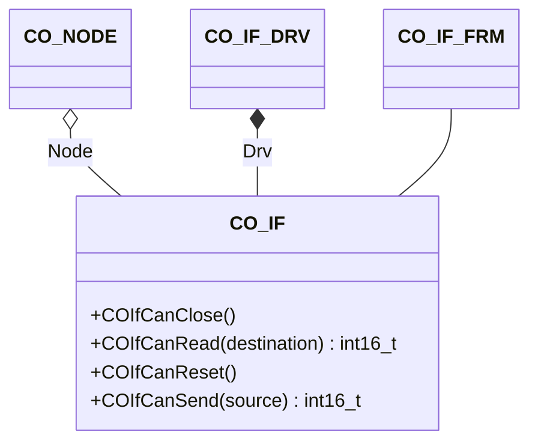

# CAN Interface

The interface component provides an interface to the hardware driver.

## Module Context



### Structure Data

The class `CO_IF` is defined within `co_if.h` and is responsible for the interface management. The following data members are in this class

| Data Member | Type        | Description                            |
| ----------- | ----------- | -------------------------------------- |
| Drv         | `CO_IF_DRV` | driver specific CAN bus identification |
| Node        | `CO_NODE*`  | pointer to parent node                 |

!!! info

    The data within this structure must never be manipulated without the corresponding class member functions. This can lead to unpredictable behavior of the node.

### Member Functions

The following table describes the API functions of the CANopen interface module. These functions are implemented within the source file: `co_if.c/h`

#### COIfCanClose()

This function closes the interface ONLY. Be careful in calling this function for an active CANopen node on this interface. This can result in unpredictable behavior of the overall system.

**Prototype**

```c
void COIfCanClose(CO_IF *cif);
```

**Arguments**

| Parameter | Description                 |
| --------- | --------------------------- |
| cif       | pointer to interface object |

**Returned Value**

- none

**Example**

The following example shows how to close the interface of the CANopen node AppNode:

```c
  :
COIfCanClose(&(AppNode.If));
  :
```

#### COIfCanRead()

If a CAN frame is received, the given receive frame buffer will be filled with the received data. The read function is rarely used from within the application because the CANopen will receive all messages by default and allows to work on all non-CANopen messages with a callback function.

!!! Important

    For evaluation, demonstration, or testing purposes this CAN read function may poll for a new CAN frame. In this special case, the additional return value with no received CAN frame is possible. Don't use the polling mode in production; you should use interrupt-driven CAN communication. The CAN polling is not suitable for CANopen.

**Prototype**

```c
int16_t COIfCanRead(CO_IF *cif, CO_IF_FRM *frm);
```

**Arguments**

| Parameter | Description                         |
| --------- | ----------------------------------- |
| cif       | pointer to interface object         |
| frm       | pointer to destination frame buffer |

**Returned Value**

- `>0` : size of `CO_IF_FRM` on success
- `=0` : special: nothing received during polling (timeout)
- `<0` : an error is detected

**Example**

If necessary, the following example show how to call the blocking receive function for the interface of the CANopen node AppNode:

```c
CO_IF_FRM frame;
int16_t   err;
  :
err = COIfCanRead(&(AppNode.If), &frame);
if (err <= 0) {

  /* error in interface layer */

} else {

  /* frame contains received data */

}
  :
```

#### COIfCanReset()

This function resets the interface ONLY. Be careful in calling this function for an active CANopen node on this interface. This can result in unpredictable behavior of the overall system.

**Prototype**

```c
void COIfCanReset(CO_IF *cif);
```

**Arguments**

| Parameter | Description                 |
| --------- | --------------------------- |
| cif       | pointer to interface object |

**Returned Value**

- none

**Example**

The following example shows how to reset the interface of the CANopen node AppNode:

```c
  :
COIfCanReset (&(AppNode.If));
  :
```

#### COIfCanSend()

The send function may be used within the application to transmit additional messages on the CANopen interface.

**Prototype**

```c
int16_t COIfCanSend(CO_IF *cif, CO_IF_FRM *frm);
```

**Arguments**

| Parameter | Description                         |
| --------- | ----------------------------------- |
| cif       | pointer to interface object         |
| frm       | pointer to destination frame buffer |

**Returned Value**

- `>0` : size of `CO_IF_FRM` on success
- `<0` : an error is detected

**Example**

The following example shows how to call the transmit function for the interface of the CANopen node AppNode:

```c
CO_IF_FRM frame;
int16_t   err;
  :
frame.Identifier = 0x123;
frame.DLC        = 8;
frame.Data[0]    = 0x12;
frame.Data[1]    = 0x23;
frame.Data[2]    = 0x34;
frame.Data[3]    = 0x45;
frame.Data[4]    = 0x56;
frame.Data[5]    = 0x67;
frame.Data[6]    = 0x78;
frame.Data[7]    = 0x89;
err = COIfCanSend(&(AppNode.If), &frame);
if (err < 0) {

  /* error in interface layer */

}
  :
```
