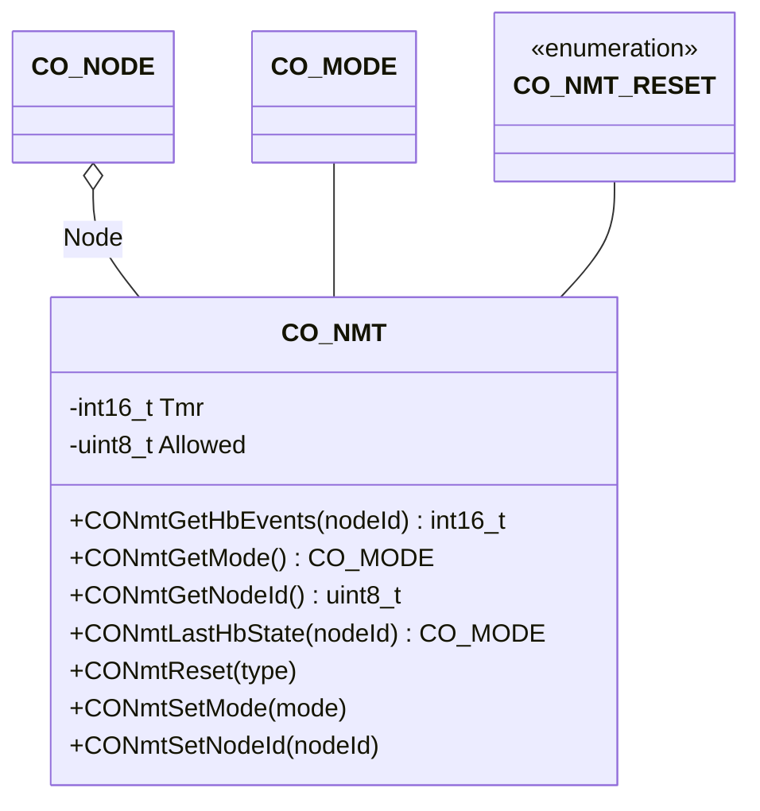

# Network Management

The network component provides an interface to the CANopen mode control, the node management, and the heartbeat handling.

## Module Context



### Structure Data

The class `CO_NMT` is defined within `co_nmt.h` and is responsible for the CANopen network slave management. The following data members are in this class:

| Data Member | Type       | Description                          |
| ----------- | ---------- | ------------------------------------ |
| Allowed     | `uint8_t`  | encoding of allowed CANopen services |
| Mode        | `CO_MODE`  | current NMT mode                     |
| Node        | `CO_NODE*` | pointer to parent node               |
| Tmr         | `int16_t`  | heartpeat producer timer identifier  |

!!! info

    The data within this structure must never be manipulated without the corresponding class member functions. This can lead to unpredictable behavior of the node.

### Member Functions

The following table describes the API functions of the CANopen network management module. Furthermore, this module includes the heartbeat producer and consumer. These functions are implemented within the source file: `co_nmt.c/h`, `co_hb_prod.c/h` and `co_hb_cons.c/h`

#### CONmtGetHbEvents()

If a second heartbeat is received within the heartbeat deadline, the heartbeat timing is marked as *ok*. If the second heartbeat is received after the heartbeat deadline, the heartbeat timing is marked as *missed*.

**Prototype**

```c
int16_t CONmtGetHbEvents (CO_NMT *nmt, uint8_t nodeId);
```

**Arguments**

| Parameter | Description                               |
| --------- | ----------------------------------------- |
| nmt       | pointer to NMT object                     |
| nodeId    | address heartbeat consumer for given node |

**Returned Value**

- `<0` : error, e.g. the given node ID is not monitored by a heartbeat consumer
- `=0` : the heartbeat consumer detects no miss event for the given node ID
- `>0` : the heartbeat consumer detects this number of missed heartbeat deadlines

**Example**

The following example shows how to check the heartbeat consumer results of the CANopen node AppNode for the CANopen Node with node-ID = 10:

```c
int16_t events;
  :
events = CONmtGetHbEvents(&(AppNode.Nmt), 10);
if (events > 0) {

  /* number of missing heartbeats of the monitored node 10 */

} else if (events < 0) {

  /* no heartbeat consumer running for node 10 */

} else {

  /* the heartbeats of node 10 are received as expected */

}
  :
```

#### CONmtGetMode()

The possible values of the reset type CO_MODE are:

| Value            | Description                                  |
| ---------------- | -------------------------------------------- |
| `CO_INVALID`     | device in INVALID mode, e.g. not initialized |
| `CO_INIT`        | device in INIT mode                          |
| `CO_PREOP`       | device in PRE-OPERATIONAL mode               |
| `CO_OPERATIONAL` | device in OPERATIONAL mode                   |
| `CO_STOP`        | device in STOP mode                          |

**Prototype**

```c
CO_MODE CONmtGetMode(CO_NMT *nmt);
```

**Arguments**

| Parameter | Description           |
| --------- | --------------------- |
| nmt       | pointer to NMT object |

**Returned Value**

- `>0` : current NMT mode
- `=0` : an error is detected

**Example**

The following example shows how to perform operations only in the operational mode of the CANopen node AppNode:

```c
CO_MODE mode;
  :
mode = CONmtGetMode(&(AppNode.Nmt));
if (mode == CO_OPERATIONAL) {

  /* perform actions in operational mode */

}
  :
```

#### CONmtGetNodeId()

There should be always a valid node ID within the CANopen Stack. The default node ID is set in the node specification.

**Prototype**

```c
uint8_t CONmtGetNodeId(CO_NMT *nmt);
```

**Arguments**

| Parameter | Description           |
| --------- | --------------------- |
| nmt       | pointer to NMT object |
| nodeId    | requested NMT node ID |

**Returned Value**

- `>0` : current NMT node ID
- `=0` : an error is detected

**Example**

The following example shows how to get the node ID of the CANopen node AppNode:

```c
uint8_t id;
  :
id = CONmtGetNodeId(&(AppNode.Nmt));
if (id == 0) {

  /* error during reading the node-ID */

} else {

  /* id holds the node ID */

}
  :
```

#### CONmtLastHbState()

The possible values of the device mode CO_MODE are:

| Value            | Description                                  |
| ---------------- | -------------------------------------------- |
| `CO_INVALID`     | device in INVALID mode, e.g. not initialized |
| `CO_INIT`        | device in INIT mode                          |
| `CO_PREOP`       | device in PRE-OPERATIONAL mode               |
| `CO_OPERATIONAL` | device in OPERATIONAL mode                   |
| `CO_STOP`        | device in STOP mode                          |

**Prototype**

```c
CO_MODE CONmtLastHbState (CO_NMT *nmt, uint8_t nodeId);
```

**Arguments**

| Parameter | Description                               |
| --------- | ----------------------------------------- |
| nmt       | pointer to NMT object                     |
| nodeId    | address heartbeat consumer for given node |

**Returned Value**

- `==CO_INVALID` : an error is detected; e.g. the given node ID is not monitored by a heartbeat consumer
- `!=CO_INVALID` : the heartbeat consumer received state from the given node ID

**Example**

The following example shows how to check the heartbeat consumer received mode of the CANopen node AppNode for the CANopen Node with node ID = 10:

```c
CO_MODE state;
  :
state = CONmtLastHbState(&(AppNode.Nmt), 10);
if (state == CO_INVALID) {

  /* no heartbeat consumer running for node 10 */

} else {

  /* you may react on specific NMT states here... */

}
  :
```

#### CONmtReset()

The possible values of the reset type `CO_NMT_RESET` are:

| Value              | Description                                |
| ------------------ | ------------------------------------------ |
| `CO_RESET_INVALID` | invalid reset type (for testing)           |
| `CO_RESET_NODE`    | reset node (application and communication) |
| `CO_RESET_COM`     | reset communication                        |

**Prototype**

```c
void CONmtReset(CO_NMT *nmt, CO_NMT_RESET type);
```

**Arguments**

| Parameter | Description              |
| --------- | ------------------------ |
| nmt       | pointer to NMT object    |
| type      | requested NMT reset type |

**Returned Value**

- none

**Example**

The following example shows how to request a communication reset of the CANopen node AppNode:

```c
  :
CONmtReset(&(AppNode.Nmt), CO_RESET_COM);
  :
```

#### CONmtSetMode()

The possible values of the device mode `CO_MODE` are:

| Value            | Description                                  |
| ---------------- | -------------------------------------------- |
| `CO_INVALID`     | device in INVALID mode, e.g. not initialized |
| `CO_INIT`        | device in INIT mode                          |
| `CO_PREOP`       | device in PRE-OPERATIONAL mode               |
| `CO_OPERATIONAL` | device in OPERATIONAL mode                   |
| `CO_STOP`        | device in STOP mode                          |

**Prototype**

```c
void CONmtSetMode(CO_NMT *nmt, CO_MODE mode);
```

**Arguments**

| Parameter | Description           |
| --------- | --------------------- |
| nmt       | pointer to NMT object |
| mode      | requested NMT mode    |

**Returned Value**

- none

**Example**

The following example shows how to switch the CANopen node AppNode in the operational mode without a CANopen master network command:

```c
  :
CONmtSetMode(&(AppNode.Nmt), CO_OPERATIONAL);
  :
```

#### CONmtSetNodeId()

The following errors are detected within this function:
- `CO_ERR_NMT_MODE` - the CANopen device is not in INIT mode
- `CO_ERR_BAD_ARG` - the given nodeId is invalid (e.g. zero)

If one of these errors is detected, this function call will change nothing.

!!! Important

    After the successful operation, the function `CONmtReset()` must be called to re-initialize the internal SDO and PDO tables.

**Prototype**

```c
void CONmtSetNodeId(CO_NMT *nmt, uint8_t nodeId);
```

**Arguments**

| Parameter | Description           |
| --------- | --------------------- |
| nmt       | pointer to NMT object |
| nodeId    | requested NMT node ID |

**Returned Value**

- none

**Example**

The following example shows how to set a dynamically determined node-ID for the CANopen node AppNode:

```c
CO_ERR  err;
uint8_t id;
  :
id = AppCalculateNodeId();
CONmtSetNodeId(&(AppNode.Nmt), id);
err = CONodeGetErr(&AppNode);
if (err == CO_ERR_NONE) {
  CONmtReset (&(AppNode.Nmt), CO_RESET_NODE);

  /* calculated node-ID is set */

} else {

  /* error during setting the node-ID */

}
  :
```
