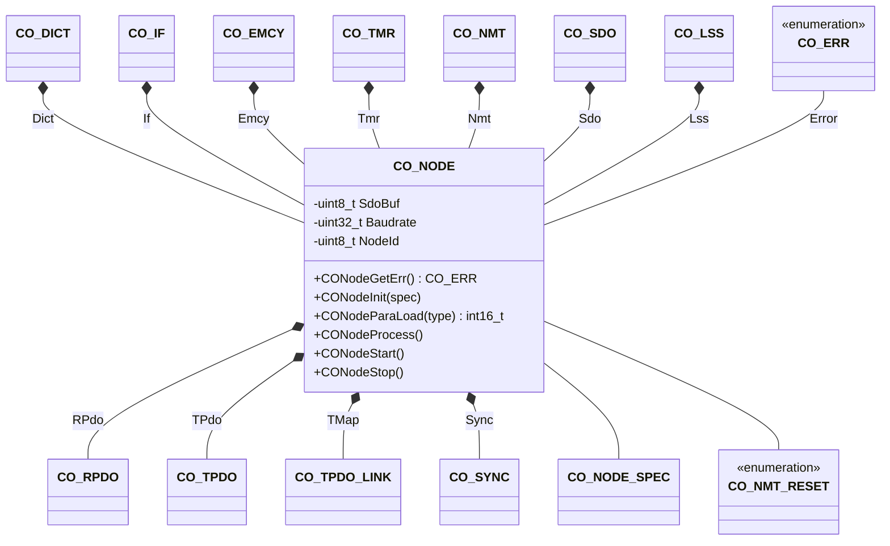

# CANopen Node

The node component is the central component and includes all other components for a single CANopen node. The node component provides the interface to the node lifecycle operations.

## Module Context



### Structure Data

The class `CO_NODE` is defined within `co_core.h` and is responsible for the overall node management functions. The node is the central data point of a CANopen device. The following data members are in this class:

| Data Member | Type           | Description                         |
| ----------- | -------------- | ----------------------------------- |
| Baudrate    | `uint32_t`     | default CAN communication baudrate  |
| Dict        | `CO_DICT`      | object dictionary object            |
| Emcy        | `CO_EMCY`      | node emergency object               |
| Error       | `CO_ERR`       | Internal error indentification code |
| If          | `CO_IF`        | CAN bus interface object            |
| Lss         | `CO_LSS`       | LSS management object               |
| Nmt         | `CO_NMT`       | node network management object      |
| NodeId      | `uint8_t`      | default CANopen node ID             |
| Sdo         | `CO_SDO`       | SDO server object array             |
| SdoBuf      | `uint8_t*`     | pointer to SDO transfer buffer      |
| Tmr         | `CO_TMR`       | timer manager object                |
| TPdo[]      | `CO_TPDO`      | transmit PDO object array           |
| TMap[]      | `CO_TPDO_LINK` | transmit PDO mapping link array     |
| RPdo[]      | `CO_RPDO`      | receive PDO object array            |
| Sync        | `CO_SYNC`      | SYNC management object              |

!!! info

    The data within this structure must never be manipulated without the corresponding class member functions. This can lead to unpredictable behavior of the node.

### Member Functions

During calling a member function of a class, the first parameter must be a reference to a corresponding object. This should be done as shown in the following examples:

```c
CO_NODE AppNode;                   /* allocate application node    */
  :
CONodeInit (&AppNode       ,...);  /* call member of class CO_NODE */
CODirFind  (&(AppNode.Dir) ,...);  /* call member of class CO_DIR  */
COIfCanSend(&(AppNode.If)  ,...);  /* call member of class CO_IF   */
COEmcySet  (&(AppNode.Emcy),...);  /* call member of class CO_EMCY */
COTmrCreate(&(AppNode.Tmr) ,...);  /* call member of class CO_TMR  */
CONmtReset (&(AppNode.Nmt) ,...);  /* call member of class CO_NMT  */
  :
```

Note, that in all application source files, which needs to call one or more CANopen API functions, the header file `co_core.h` must be included.

The following table describes the API functions of the CANopen core module. These functions are implemented within the source file: `co_core.c/h`

#### CONodeGetErr()

If an error was detected, the error is cleared with this function call.

**Prototype**

```c
CO_ERR CONodeGetErr(CO_NODE *node);
```

**Arguments**

| Parameter | Description            |
| --------- | ---------------------- |
| node      | pointer to node object |

**Returned Value**

One of the following error codes:

| Error code              | Description                                |
| ----------------------- | ------------------------------------------ |
| CO_ERR_NONE             | no error                                   |
| CO_ERR_BAD_ARG          | invalid argument                           |
| CO_ERR_OBJ_NOT_FOUND    | searched object not found in directory     |
| CO_ERR_OBJ_READ         | error during reading an object entry       |
| CO_ERR_OBJ_WRITE        | error during writing an object entry       |
| CO_ERR_OBJ_SIZE         | read/write with a wrong size to object     |
| CO_ERR_OBJ_MAP_LEN      | invalid mapping length                     |
| CO_ERR_OBJ_MAP_TYPE     | invalid mapping type                       |
| CO_ERR_OBJ_ACC          | unsupported access                         |
| CO_ERR_OBJ_RANGE        | value range of parameter exceeded          |
| CO_ERR_OBJ_INCOMPATIBLE | incompatible parameter value               |
| CO_ERR_PARA_IDX         | wrong index for parameter type             |
| CO_ERR_PARA_STORE       | error during storing parameter             |
| CO_ERR_PARA_RESTORE     | error during restoring parameter           |
| CO_ERR_PARA_LOAD        | error during loading parameter             |
| CO_ERR_CFG_1001_0       | entry 1001:0 is bad/not existing           |
| CO_ERR_CFG_1003_0       | entry 1003:0 is bad/not existing           |
| CO_ERR_CFG_1003_1       | entry 1003:1 is bad/not existing           |
| CO_ERR_CFG_1005_0       | entry 1005:0 is bad/not existing           |
| CO_ERR_CFG_1010_0       | entry 1010:0 is bad/not existing           |
| CO_ERR_CFG_1011_0       | entry 1011:0 is bad/not existing           |
| CO_ERR_CFG_1014_0       | entry 1014:0 is bad/not existing           |
| CO_ERR_CFG_1016         | entry in 1016 is bad/not existing          |
| CO_ERR_CFG_1017_0       | entry 1017:0 is bad/not existing           |
| CO_ERR_CFG_1018         | entry in 1018 is bad/not existing          |
| CO_ERR_TMR_NO_ACT       | no action available while creating         |
| CO_ERR_TMR_INSERT       | error during insert action in tmr-list     |
| CO_ERR_TMR_CREATE       | error during creating a timed action       |
| CO_ERR_TMR_DELETE       | error during deleting a timed action       |
| CO_ERR_NMT_INIT         | error during initializing NMT slave        |
| CO_ERR_NMT_APP_RESET    | error in resetting application             |
| CO_ERR_NMT_COM_RESET    | error in resetting communication           |
| CO_ERR_NMT_MODE         | action not allowed in current NMT mode     |
| CO_ERR_LSS_LOAD         | error during loading the LSS configuration |
| CO_ERR_LSS_STORE        | error during writing the LSS configuration |
| CO_ERR_EMCY_BAD_ROOT    | error in emcy structure, member: Root      |
| CO_ERR_TPDO_COM_OBJ     | config error in TPDO communication         |
| CO_ERR_TPDO_MAP_OBJ     | config error in TPDO mapping               |
| CO_ERR_TPDO_OBJ_TRIGGER | error during trigger via an object         |
| CO_ERR_TPDO_NUM_TRIGGER | error during trigger via a PDO number      |
| CO_ERR_TPDO_INHIBIT     | error during inhibit timer creation        |
| CO_ERR_TPDO_EVENT       | error during event timer creation          |
| CO_ERR_RPDO_COM_OBJ     | config error in RPDO communication         |
| CO_ERR_RPDO_MAP_OBJ     | config error in RPDO mapping               |
| CO_ERR_SDO_READ         | error during in SDO block reading          |
| CO_ERR_SDO_WRITE        | error during in SDO block writing          |
| CO_ERR_SYNC_MSG         | error during receive synchronous PDO       |
| CO_ERR_IF_INIT          | error during initialization                |
| CO_ERR_IF_ENABLE        | error during enabling the interface        |
| CO_ERR_IF_FLUSH_RX      | error during flushing RX interface         |
| CO_ERR_IF_FLUSH_TX      | error during flushing TX interface         |
| CO_ERR_IF_RESET         | error during resetting interface           |
| CO_ERR_IF_CLOSE         | error during closing the interface         |
| CO_ERR_IF_READ          | error during reading from interface        |
| CO_ERR_IF_SEND          | error during sending to interface          |
| CO_ERR_SIG_INIT         | error during initializing CAN signals      |
| CO_ERR_SIG_CREATE       | error during creating a needed signal      |
| CO_ERR_MSG_INIT         | error during message initialization        |
| CO_ERR_MSG_CREATE       | error during creating a message            |
| CO_ERR_MSG_READ         | error during reading a message             |
| CO_ERR_TYPE_RD          | error during reading type                  |
| CO_ERR_TYPE_CTRL        | error during type control                  |
| CO_ERR_TYPE_WR          | error during writing type                  |

**Example**

The following example demonstrates a diagnostic section of a CANopen startup sequence:

```c
  :
CONodeInit(&AppNode, (CO_NODE_SPEC *)&AppSpec);

err = CONodeGetErr(&AppNode);
if (err == CO_ERR_NONE) {
  CONodeStart(&AppNode);
} else {

  /* handle detected error according to your application */

}
  :
```

#### CONodeInit()

The specification of the CANopen node, and the CANopen node object itself is given as a parameter.

**Prototype**

```c
void CONodeInit(CO_NODE *node, CO_NODE_SPEC *spec);
```

**Arguments**

| Parameter | Description                          |
| --------- | ------------------------------------ |
| node      | pointer to node object               |
| spec      | pointer to node specification object |

**Returned Value**

- none

**Example**

The following example shows the external reference to the node specification AppSpec which is typically allocated within a configuration file and the allocation of the CANopen node memory AppNode.

```c
extern const CO_NODE_SPEC AppSpec;
             CO_NODE      AppNode;
```

With these objects, the CANopen node can be initialized and started:

```c
  :
CONodeInit(&AppNode, (CO_NODE_SPEC *)&AppSpec);
  :
```

#### CONodeParaLoad()

A single parameter group will be loaded from NVM by calling the nvm driver function for reading data.

This function considers all parameter groups, which are linked to the parameter store index (1010h) within the object dictionary. Every not linked parameter group is not the scope of this function and must be handled within the application.

**Prototype**

```c
int16_t CONodeParaLoad(CO_NODE *node, CO_NMT_RESET type);
```

**Arguments**

| Parameter | Description                                    |
| --------- | ---------------------------------------------- |
| node      | pointer to node object                         |
| type      | reset type, e.g. CO_RESET_COM or CO_RESET_NODE |

**Returned Value**

- `=0` : loading successful
- `<0` : an error is detected and function aborted

**Example**

The function `CONodeParaLoad()` is rarely called from within the applications. Typically the CANopen master requests the parameter loading via NMT command. In some special cases it is useful to initiate a reset from the slave application. The following example shows the sequence to load all parameters, which are linked to the object directory entries related to the communication profile (index 1000h to 1FFFh).

```c
  :
success = CONodeParaLoad(&AppNode, CO_RESET_COM);
if (success < 0) {
  err = CONodeGetErr(&AppNode);

  /* handle error during parameter loading */

}
  :
```

#### CONodeProcess()

This function is responsible for performing the necessary response to a received CAN frame.

**Prototype**

```c
void CONodeProcess(CO_NODE *node);
```

**Arguments**

| Parameter | Description            |
| --------- | ---------------------- |
| node      | pointer to node object |

**Returned Value**

- none

**Example**

The function `CONodeProcess()` is most likely called in the background function loop. When using an RTOS, the CANopen node processing from within a separate task is possible, too. In this case, the blocking mode is suitable for most applications:

```c
void CanRxTask(void *arg_p)
{
  CO_NODE *node = (CO_NODE *)arg_p;   /* task parameter is a ptr to   */
                                      /* CANopen node object          */

  while(1) {                          /* endless RTOS task loop       */
    CONodeProcess(node);              /* wait and process CAN frames  */
  }
}
```

#### CONodeStart()

The node will change into the PRE-OPERATIONAL state and is ready for communication.

**Prototype**

```c
void CONodeStart(CO_NODE *node);
```

**Arguments**

| Parameter | Description            |
| --------- | ---------------------- |
| node      | pointer to node object |

**Returned Value**

- none

**Example**

The following example shows the typical startup of a CANopen node AppNode with the specification AppSpec:

```c
CO_ERR err;
  :
CONodeInit(&AppNode, (CO_NODE_SPEC *)&AppSpec);

err = CONodeGetErr(&AppNode);
if (err == CO_ERR_NONE) {
  CONodeStart(&AppNode);
} else {

  /* error handling and diagnostics */

}
  :
```

#### CONodeStop()

This function removes the CANopen node from the CAN bus interface.

To reactivate a stopped CANopen node, the functions `CONodeInit()` and `CONodeStart()` must be called again.

**Prototype**

```c
void CONodeStop(CO_NODE *node);
```

**Arguments**

| Parameter | Description            |
| --------- | ---------------------- |
| node      | pointer to node object |

**Returned Value**

- none

**Example**

The following example shows the sequence for restarting a CANopen node AppNode. Assuming the CANopen stack is initialized and started before, we can stop and re-initialize the stack to reset the node completely.

```c
  :
CONodeStop(&AppNode);
  :
/* do something with stopped CANopen node */
  :
CONodeInit(&AppNode, (CO_NODE_SPEC *)&AppSpec);

err = CONodeGetErr(&AppNode);
if (err == CO_ERR_NONE) {
  CONodeStart(&AppNode);
} else {

  /* error handling and diagnostics */

}
  :
```

!!! attention

    The shown example is NOT identical to the standard node reset which can be requested from the CANopen master or via the API function `CONmtReset()`. The difference is: the example will transmit the boot-up message.
