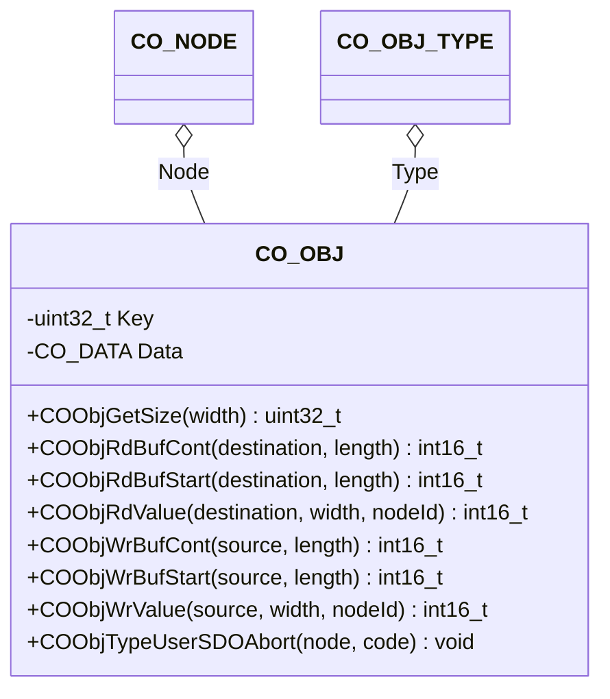

# Object Entry

The object component provides an interface to the individual object entries.

## Module Context



### Structure Data

The class `CO_OBJ` is defined within `co_obj.h` and is responsible for the CANopen object entry data access handling. The following data members are in this class:

| Data Member | Type           | Description                        |
| ----------- | -------------- | ---------------------------------- |
| Data        | `CO_DATA`      | data information of object entry   |
| Key         | `uint32_t`     | Encoded object entry properties    |
| Type        | `CO_OBJ_TYPE*` | pointer to object type             |

!!! info

    The data within this structure must never be manipulated without the corresponding class member functions. This can lead to unpredictable behavior of the node.

### Member Functions

The following table describes the API functions of the CANopen object entry module. These functions are implemented within the source file: `co_obj.c/h`

#### COObjGetSize()

The argument width is most likely given '0' (=unknown) when getting the size of an object entry. The intended use of this argument is for write access of dynamic sizes of user type objects (e.g. firmware loading with a maximum size).

**Prototype**

```c
uint32_t COObjGetSize(CO_OBJ *obj,
                      CO_NODE *node,
                      uint32_t width);
```

**Arguments**

| Parameter | Description                                    |
| --------- | ---------------------------------------------- |
| obj       | pointer to object entry                        |
| node      | pointer to parent node                         |
| width     | expected object size in byte (or 0 if unknown) |

**Returned Value**

- `>0` : object entry size in bytes
- `=0` : an error is detected

**Example**

The following example gets the size of the hypothetical application-specific object entry "[1234:56]" within the object dictionary of the CANopen node AppNode.

```c
uint32_t  size;
CO_OBJ   *entry;
  :
entry = CODictFind  (&(AppNode.Dict), CO_DEV(0x1234,0x56));
size  = COObjGetSize(entry, &AppNode, 0);
  :
```

#### COObjRdBufCont()

The function is used together with `COObjRdBufStart()` to read an object entry with a size greater than 4.

**Prototype**

```c
int16_t COObjRdBufCont(CO_OBJ  *obj,
                       CO_NODE *node,
                       void    *buffer,
                       uint8_t  length);
```

**Arguments**

| Parameter | Description                   |
| --------- | ----------------------------- |
| obj       | pointer to object entry       |
| node      | pointer to parent node        |
| buffer    | pointer to destination memory |
| length    | length of destination buffer  |

**Returned Value**

- `==CO_ERR_NONE` : successful operation
- `!=CO_ERR_NONE` : an error is detected

**Example**

see [Example in COObjRdBufStart()][1]

!!! attention

    This function is used when reading data in smaller junks (e.g. internaly the SDO transfers is using this function). Within the application you most likely use the related memory area due to performance issues.

#### COObjRdBufStart()

The function is used together with `COObjRdBufCont()` to read an object entry with a size greater than 4.

**Prototype**

```c
int16_t COObjRdBufStart(CO_OBJ  *obj,
                        CO_NODE *node,
                        void    *buffer,
                        uint8_t  length);
```

**Arguments**

| Parameter | Description                   |
| --------- | ----------------------------- |
| obj       | pointer to object entry       |
| node      | pointer to parent node        |
| buffer    | pointer to destination memory |
| length    | length of destination buffer  |

**Returned Value**

- `==CO_ERR_NONE` : successful operation
- `!=CO_ERR_NONE` : an error is detected

**Example**

The following example reads the byte-stream of the hypothetical application-specific object entry "[1234:56]" within the object directory of the CANopen node AppNode in junks of 10 Byte.

```c
uint8_t  active;
  :
uint8_t  buffer[10];
int16_t  err;
CO_OBJ  *entry;
  :
entry = CODictFind(&(AppNode.Dict), CO_DEV(0x1234,0x56));
if (active = 0) {
  err = COObjRdBufStart(entry, &AppNode, buffer, 10);
  if (err == CO_ERR_NONE) {
    active = 1;
  } else {

    /* error handline and diagnostics */

  }
} else {
  /* read the next 10 Byte snippet from object entry */
  err = COObjRdBufCont(entry, &AppNode, buffer, 10);
  if (err == CO_ERR_NONE) {

    /* do something with the 10 Byte data snippet */

  } else {
    active = 0;
  }
}
  :
```

!!! attention

    This function is used when reading data in smaller junks (e.g. internaly the SDO transfers is using this function). Within the application you most likely use the related memory area due to performance issues.

#### COObjRdValue()

The access with this function to an object entry will be done with the casting of the object entry values to the requested value width.

**Prototype**

```c
int16_t COObjRdValue(CO_OBJ  *obj ,
                     CO_NODE *node,
                     void    *value,
                     uint8_t  width,
                     uint8_t  nodeId);
```

**Arguments**

| Parameter | Description                                                                                    |
| --------- | ---------------------------------------------------------------------------------------------- |
| obj       | pointer to object entry                                                                        |
| node      | pointer to parent node                                                                         |
| value     | pointer to destination memory                                                                  |
| width     | width of read value (must be 1, 2 or 4 and reflecting the width of the referenced value space) |
| nodeId    | device node ID (only relevant in case of node ID dependent value)                              |

**Returned Value**

- `==CO_ERR_NONE` : successful operation
- `!=CO_ERR_NONE` : an error is detected

**Example**

The following example gets the value of the hypothetical application-specific object entry "[1234:56]" within the object dictionary of the CANopen node AppNode.

```c
uint32_t  value;
CO_OBJ   *entry;
  :
entry = CODictFind  (&(AppNode.Dict), CO_DEV(0x1234,0x56));
err   = COObjRdValue(entry, &AppNode, &value, sizeof(value), 0);
  :
```

!!! note

    The example shows the read access with the knowledge, that the addressed object entry is independent of the node ID. To be independent of this knowledge, the API function `CONmtGetNodeId()` may be used to get the current node ID.

#### COObjTypeUserSDOAbort()

This function allows the definition of user defined SDO abort codes within user type function implementations.

**Prototype**

```c
void COObjTypeUserSDOAbort(CO_OBJ *obj,
                           CO_NODE *node,
                           uint32_t abort);
```

**Arguments**

| Parameter | Description             |
| --------- | ----------------------- |
| obj       | pointer to object entry |
| node      | pointer to parent node  |
| abort     | user defined abort code |

**Example**

The following write-function for the type `COTDemo` send the user defined SDO Abort code "0x01020304" on a write access to object entries with this user type.

```c
const CO_OBJ_TYPE COTDemo = { 0, 0, 0, DemoWrite };

#define CO_TDEMO ((CO_OBJ_TYPE*)&COTDemo)

int16_t DemoWrite(CO_OBJ *obj, struct CO_NODE_T *node, void *buf, uint32_t size)
{
  /* define the SDO Abort code */
  COObjTypeUserSDOAbort(obj, node, 0x01020304);

  /* indicate an write error */
  return CO_ERR_TYPE_WR;
}
```

!!! attention

    The CiA standard doesn't reserve or allow any manufacturer specific SDO Abort code regions. Therefore, use this function with care.

#### COObjWrBufCont()

The function is used together with `COObjWrBufStart()` to write an object entry with a size greater than 4.

**Prototype**

```c
int16_t COObjWrBufCont(CO_OBJ  *obj,
                       CO_NODE *node,
                       void    *buffer,
                       uint8_t  length);
```

**Arguments**

| Parameter | Description              |
| --------- | ------------------------ |
| obj       | pointer to object entry  |
| node      | pointer to parent node   |
| buffer    | pointer to source memory |
| length    | length of source buffer  |

**Returned Value**

- `==CO_ERR_NONE` : successful operation
- `!=CO_ERR_NONE` : an error is detected

**Example**

see [Example in COObjWrBufStart()][2]

#### COObjWrBufStart()

The function is used together with `COObjWrBufCont()` to write an object entry with a size greater than 4.

**Prototype**

```c
int16_t COObjWrBufStart(CO_OBJ  *obj,
                        CO_NODE *node,
                        void    *buffer,
                        uint8_t  length);
```

**Arguments**

| Parameter | Description              |
| --------- | ------------------------ |
| obj       | pointer to object entry  |
| node      | pointer to parent node   |
| buffer    | pointer to source memory |
| length    | length of source buffer  |

**Returned Value**

- `==CO_ERR_NONE` : successful operation
- `!=CO_ERR_NONE` : an error is detected

**Example**

The following example writes a byte-stream to the hypothetical application-specific object entry "[1234:56]" within the object directory of the CANopen node AppNode.

```c
CPU_INT08U  buffer[10] = { 'H', 'e', 'l', 'l', 'o', 'W', 'o', 'r', 'l', 'd' };
CPU_INT16S  err;
CO_OBJ     *entry;
  :
entry = CODictFind     (&(AppNode.Dict), CO_DEV(0x1234,0x56));
err   = COObjWrBufStart(entry, &AppNode, buffer, 10);
if (err == CO_ERR_NONE) {
  do {
    /* stream bytes to object */
    err = COObjWrBufCont(entry, &AppNode, buffer, 10);
  } while (err == CO_ERR_NONE);
} else {

  /* error during writing */

}
  :
```

!!! attention

    This function is used when reading data in smaller junks (e.g. internaly the SDO transfers is using this function). Within the application you most likely use the related memory area due to performance issues.

#### COObjWrValue()

The access with this function to an object entry will be done with the casting of the object entry values to the requested value width.

**Prototype**

```c
int16_t COObjWrValue(CO_OBJ  *obj ,
                     CO_NODE *node,
                     void    *value,
                     uint8_t  width,
                     uint8_t  nodeId);
```

**Arguments**

| Parameter | Description                                                                                                            |
| --------- | ---------------------------------------------------------------------------------------------------------------------- |
| obj       | pointer to object entry                                                                                                |
| node      | pointer to parent node                                                                                                 |
| value     | pointer to source memory                                                                                               |
| width     | width of write value (must be 1, 2 or 4 and reflecting the width of the referenced variable, given by parameter value) |
| nodeId    | device node ID (only relevant in case of node ID dependent value)                                                      |

**Returned Value**

- `==CO_ERR_NONE` : successful operation
- `!=CO_ERR_NONE` : an error is detected

**Example**

The following example writes a byte-stream to the hypothetical application-specific object entry "[1234:56]" within the object directory of the CANopen node AppNode.


```c
uint32_t  value = 1234;
CO_OBJ   *entry;
  :
entry = CODictFind  (&(AppNode.Dict), CO_DEV(0x1234,0x56));
err   = COObjWrValue(entry, &AppNode, &value, sizeof(value), 0);
  :
```

!!! note

    The example shows the write access with the knowledge, that the addressed object entry is independent of the node ID. To be independent of this knowledge, the API function `CONmtGetNodeId()` may be used to get the current node ID.


[1]: ../object/#coobjrdbufstart
[2]: ../object/#coobjwrbufstart
