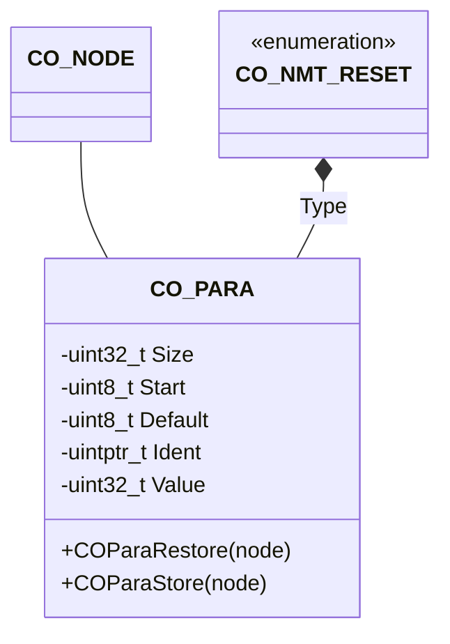

# Parameter Storage

The parameter component provides an interface to the parameter group handling.

## Module Context



### Structure Data

The class `CO_PARA` is defined within `co_para.h` and is responsible for storing and restoring the right CANopen parameter groups in dependency to the NMT reset type. The following data members are in this class:

| Data Member | Type           | Description                              |
| ----------- | -------------- | ---------------------------------------- |
| Default     | `uint8_t*`     | pointer to default parameter block       |
| Ident       | `uintptr_t*`   | pointer to user identification code      |
| Size        | `uint32_t`     | size of parameter memory block           |
| Start       | `uint8_t*`     | pointer to parameter memory block        |
| Type        | `CO_NMT_RESET` | parameter group reset type               |
| Value       | `uint32_t`     | value, when reading this parameter group |

### Member Functions

The following table describes the API functions of the CANopen parameter module. These functions are implemented within the source file: `co_para.c/h`

#### COParaRestore()

The changes in the NVM of the given parameter group will be replaced with the default values by calling the user callback function `CO_ParaDefault()`.

**Prototype**

```c
CO_ERR COParaRestore(CO_PARA *pg, CO_NODE *node);
```

**Arguments**

| Parameter | Description                |
| --------- | -------------------------- |
| pg        | pointer to parameter group |
| node      | pointer to parent node     |

**Returned Value**

- `==CO_ERR_NONE` : successful operation
- `!=CO_ERR_NONE` : an error is detected

#### COParaStore()

The whole parameter group will be stored in NVM by calling the NVM driver function for writing data.

**Prototype**

```c
CO_ERR COParaStore(CO_PARA *pg, CO_NODE *node);
```

**Arguments**

| Parameter | Description                |
| --------- | -------------------------- |
| pg        | pointer to parameter group |
| node      | pointer to parent node     |

**Returned Value**

- `==CO_ERR_NONE` : successful operation
- `!=CO_ERR_NONE` : an error is detected
