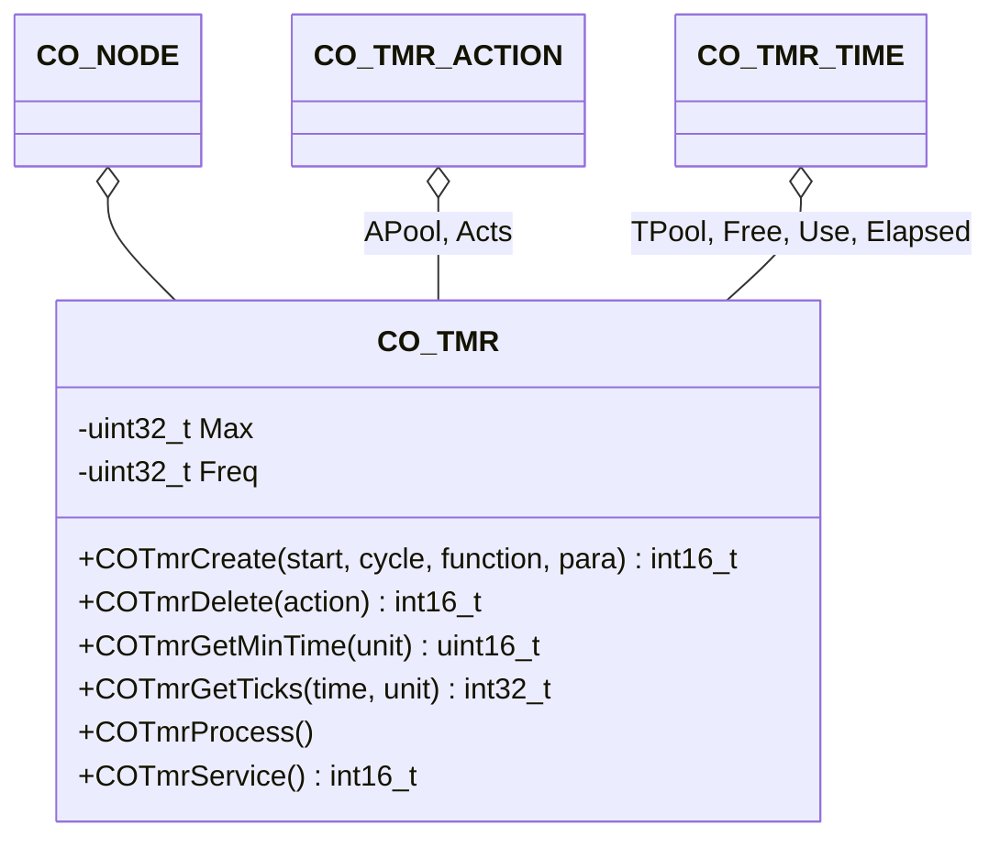

# Timer Handling

The timer component provides an interface to function executions initiated by a timer.

## Module Context



### Structure Data

The class `CO_TMR` is defined within `co_tmr.h` and is responsible for the CANopen highspeed timer management. The following data members are in this class:

| Data Member | Type             | Description                                       |
| ----------- | ---------------- | ------------------------------------------------- |
| Acts        | `CO_TMR_ACTION*` | pointer to the root of free actions linked list   |
| APool[]     | `CO_TMR_ACTION`  | timer action pool array                           |
| Elapsed     | `CO_TMR_TIME*`   | pointer to the root of elapsed timers linked list |
| Free        | `CO_TMR_TIME*`   | pointer to the root of free events linked list    |
| Freq        | `uint32_t`       | timer ticks per second                            |
| Max         | `uint32_t`       | maximum nunber of timed actions                   |
| Node        | `CO_NODE*`       | pointer to parent node object                     |
| TPool[]     | `CO_TMR_TIME`    | timer event pool array                            |
| Use         | `CO_TMR_TIME*`   | pointer to the root of used events linked list    |

!!! note

    The data within this structure must never be manipulated without the corresponding class member functions. This can lead to unpredictable behavior of the node.

### Member Functions

The following table describes the API functions of the CANopen timer module. With the listed functions we can define the execution of actions after a given time interval with or without a cycle time. The functions are implemented within the source files: `co_tmr.c/h`.

#### COTmrCreate()

This function is used within the CANopen stack for timed actions. It is possible to use timed actions in the application, too.

**Prototype**

```c
int16_t COTmrCreate(CO_TMR      *tmr,
                    uint32_t     start,
                    uint32_t     cycle,
                    CO_TMR_FUNC  function,
                    void        *para);
```

**Arguments**

| Parameter | Description                                                  |
| --------- | ------------------------------------------------------------ |
| tmr       | pointer to timer object                                      |
| start     | delta time in ticks for the first timer-event                |
| cycle     | if != 0, the delta time in ticks for the cyclic timer events |
| function  | pointer to the action callback function                      |
| para      | pointer to the callback function parameter                   |

**Returned Value**

- `>=0` : action identifier (successful operation)
- `<0` : an error is detected

**Example**

The following example installs a cyclic called function `AppCyclicFunc()` to the CANopen node AppNode. The timed function will be called the first time after 10ms and then every 25ms with the parameter: 0xcafe.

```c
CO_TMR  *tmr;
int16_t  aid;
uint32_t start;
uint32_t cycle;
  :
tmr   = &AppNode.Tmr;
start = COTmrGetTicks(tmr, 10, CO_TMR_UNIT_1MS);
cycle = COTmrGetTicks(tmr, 25, CO_TMR_UNIT_1MS);
aid = COTmrCreate(tmr, start, cycle, AppCyclicFunc, 0xcafe);
if (aid >= 0) {

  /* tid holds the timer identifier */

} else {

  /* error during creation of timed action */

}
  :
```

!!! note

    The example assumes, that the timer callback function `AppCyclicFunc()` is implemented with the correct prototype. The hardware timer is configured with sufficient timer clock frequency to achieve the 5ms resolution.

#### COTmrDelete()

This function is used within the CANopen stack for timed actions. It is possible to use timed actions in the application, too.

**Prototype**

```c
int16_t COTmrDelete(CO_TMR  *tmr,
                    int16_t  action);
```

**Arguments**

| Parameter | Description                                                               |
| --------- | ------------------------------------------------------------------------- |
| tmr       | pointer to timer object                                                   |
| action    | action identifier, returned by [`COTmrCreate()`][1] |

**Returned Value**

- `>=0` : action identifier (successful operation)
- `<0` : an error is detected

**Example**

The following calls a critical function `AppCritFunc()` and installs a function `AppEmcyFunc()` to the CANopen node AppNode to guarantee a maximum runtime of 150ms. The timed function will be called after 150ms and perform emergency handling with the parameter 0xdead. If the `AppCritFunc()` is finished before 150ms, the timed emergency function call will be removed.

```c
CO_TMR     *tmr;
CPU_INT16S  aid;
uint32_t    max;
  :
tmr = &AppNode.Tmr;
max = COTmrGetTicks(tmr, 150, CO_TMR_UNIT_1MS);
aid = COTmrCreate(tmr, max, 0, AppEmcyFunc, 0xdead);
if (aid >= 0) {
  AppCritFunc();
  err = COTmrDelete(tmr, aid);
  if (err < 0) {

    /* error during deleting the timed action */

  }
} else {

  /* error during creation of timed action */

}
  :
```

!!! note

    The example assumes, that the timer callback function `AppEmcyFunc()` and the application function `AppCritFunc()` are implemented with the correct prototype. The hardware timer is configured with sufficient timer clock frequency to achieve the 50ms resolution.

#### COTmrGetMinTime()

This function returns the time interval in the given unit, which represents a single configured timer tick.

**Prototype**

```c
uint16_t COTmrGetMinTime(CO_TMR   *tmr,
                         uint32_t  unit);
```

**Arguments**

| Parameter | Description                                                   |
| --------- | ------------------------------------------------------------- |
| tmr       | pointer to timer object                                       |
| unit      | unit of given time (`CO_TMR_UNIT_1MS` or `CO_TMR_UNIT_100US`) |

**Returned Value**

- `>0` : time value in the given time interval for a single timer tick
- `=0` : a single given time interval unit is not possible with the used timer

**Example**

The following example calculates the smallest possible time interval in 100us.

```c
CO_TMR  *tmr;
uint32_t min_100us;
  :
tmr = &AppNode.Tmr;
  :
min_100us = COTmrGetMinTime(tmr, CO_TMR_UNIT_100US);
if (min_100us == 0) {

  /* timer is not configured */

} else {

  /* you can use time intervals with multiple of min_100us */

}
  :
```

#### COTmrGetTicks()

This function is used within the CANopen stack for calculating timeouts, event-times and other needed time intervals.

**Prototype**

```c
int32_t COTmrGetTicks(CO_TMR   *tmr,
                      uint16_t  time,
                      uint32_t  unit);
```

**Arguments**

| Parameter | Description                                                   |
| --------- | ------------------------------------------------------------- |
| tmr       | pointer to timer object                                       |
| time      | time interval as a value of given units                       |
| unit      | unit of given time (`CO_TMR_UNIT_1MS` or `CO_TMR_UNIT_100US`) |

**Returned Value**

- `>0` : timer ticks for the given time interval
- `=0` : given time interval is not possible with the used timer

**Example**

The following example calculates the number of ticks for 10.7ms and for 2.5s.

```c
CO_TMR  *tmr;
uint32_t tick_10_7ms;
uint32_t tick_2500ms;
  :
tmr = &AppNode.Tmr;
  :
tick_10_7ms = COTmrGetTicks(tmr, 107, CO_TMR_UNIT_100US);
if (tick_10_7ms == 0) {

  /* time interval 10.7ms is not possible */

} else {

  /* you can use the time interval 10.7ms */

}
  :
tick_2500ms = COTmrGetTicks(tmr, 2500, CO_TMR_UNIT_1MS);
if (tick_2500ms == 0) {

  /* time interval 2.5s is not possible */

} else {

  /* you can use the time interval 2.5s */

}
  :
```

!!! note

    The example assumes that the CANopen node is already initialized with `CONodeInit()` because the specified frequency in the specification structure is the foundation for these calculations.

#### COTmrProcess()

The function is used decouple the generation of the periodic time base and the timed action processing.

**Prototype**

```c
void COTmrProcess(CO_TMR *tmr);
```

**Arguments**

| Parameter | Description             |
| --------- | ----------------------- |
| tmr       | pointer to timer object |

**Returned Value**

- none

**Example**

The timed action processing must be called cyclic. Due to the timer management, the calling sequence is irrelevant. Therefore the function may be called in the background loop of the application:

```c
void main(int argc, char *argv[])
{
    :
  while (1) {
      :
    COTmrProcess(&(AppNode.Tmr));
      :
  }
}
```

#### COTmrService()

The function is used to generate a periodic time base and must be called cyclic.

**Prototype**

```c
int16_t COTmrService(CO_TMR *tmr);
```

**Arguments**

| Parameter | Description             |
| --------- | ----------------------- |
| tmr       | pointer to timer object |

**Returned Value**

- `=0` : no timer is elapsed
- `>0` : at least one timer is elapsed
- `<0` : an error is detected

**Example**

The following interrupt service function generates the time base for the CANopen timed actions with periodic calls of the function `COTmrService()`. When using an RTOS, the return value may be used to decide of triggering a separate timer task to process the elapsed events.

```c
void HardwareTimerISR(void)
{
    int16_t num;

    num = COTmrService(&(AppNode.Tmr));
    if (num > 0) {

        /* post an event to the timer processing task */

    }
}
```


[1]: ../timer/#cotmrcreate