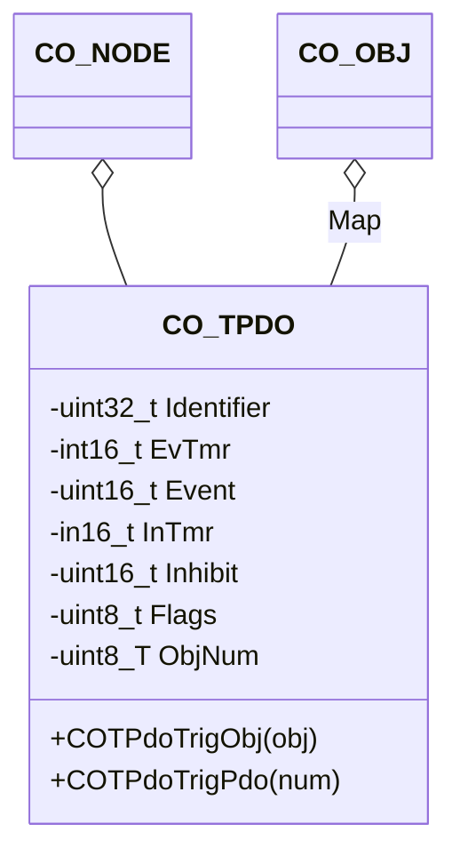

# TPDO Event

The TPDO component provides an interface to the CANopen PDO transmission triggers.

## Module Context



### Structure Data

The class `CO_TPDO` is defined within `co_tpdo.h` and is responsible for the CANopen transmit process data objects (TPDO). The following data members are in this class:

| Data Member | Type       | Description                           |
| ----------- | ---------- | ------------------------------------- |
| Event       | `uint16_t` | event time in timer ticks             |
| EvTmr       | `int16_t`  | event timer identifier                |
| Flags       | `uint8_t`  | transmit status flags                 |
| Identifier  | `uint32_t` | CAN message identifier                |
| Inhibit     | `uint16_t` | inhibit timer in timer ticks          |
| InTmr       | `int16_t`  | inhibit timer identifier              |
| Map[]       | `CO_OBJ*`  | pointer list to mapped object entries |
| Size[]      | `uint8_t*` | size of mapped values in PDO payload  |
| Node        | `CO_NODE*` | pointer to parent node                |
| ObjNum      | `uint8_t`  | number of mapped object entries       |

!!! info

    The data within this structure must never be manipulated without the corresponding class member functions. This can lead to unpredictable behavior of the node.

### Member Functions

The following table describes the API functions of the CANopen transmit PDO module. These functions are implemented within the source file: `co_tpdo.c/h`

#### COTPdoTrigObj()

The event will be distributed to all TPDOs, which holds an active mapping entry to this object entry.

**Prototype**

```c
void COTPdoTrigObj(CO_TPDO *pdo, CO_OBJ *obj);
```

**Arguments**

| Parameter | Description                    |
| --------- | ------------------------------ |
| pdo       | pointer to start of TPDO array |
| obj       | pointer to object entry        |

**Returned Value**

- none

**Example**

The following example triggers the transmission of all TPDOs of the CANopen node AppNode, which contains the hypothetical object directory entry "[1234:56]".

```c
CO_OBJ *entry;
  :
entry = CODirFind(&(AppNode.Dir), CO_DEV(0x1234, 0x56));
COTPdoTrigObj(&(AppNode.TPdo[0]), entry);
  :
```

#### COTPdoTrigPdo()

The function call will immediately initiate the TPDO transmission, independent on the TPDO communication type settings in the object dictionary.

**Prototype**

```c
void COTPdoTrigPdo(CO_TPDO *pdo, uint16_t num);
```

**Arguments**

| Parameter | Description                    |
| --------- | ------------------------------ |
| pdo       | pointer to start of TPDO array |
| num       | number of TPDO (0..511)        |

**Returned Value**

- none

**Example**

The following example triggers the transmission of TPDO #3 of the CANopen node AppNode.

```c
  :
COTPdoTrigPdo(&(AppNode.TPdo[0]), 3);
  :
```
