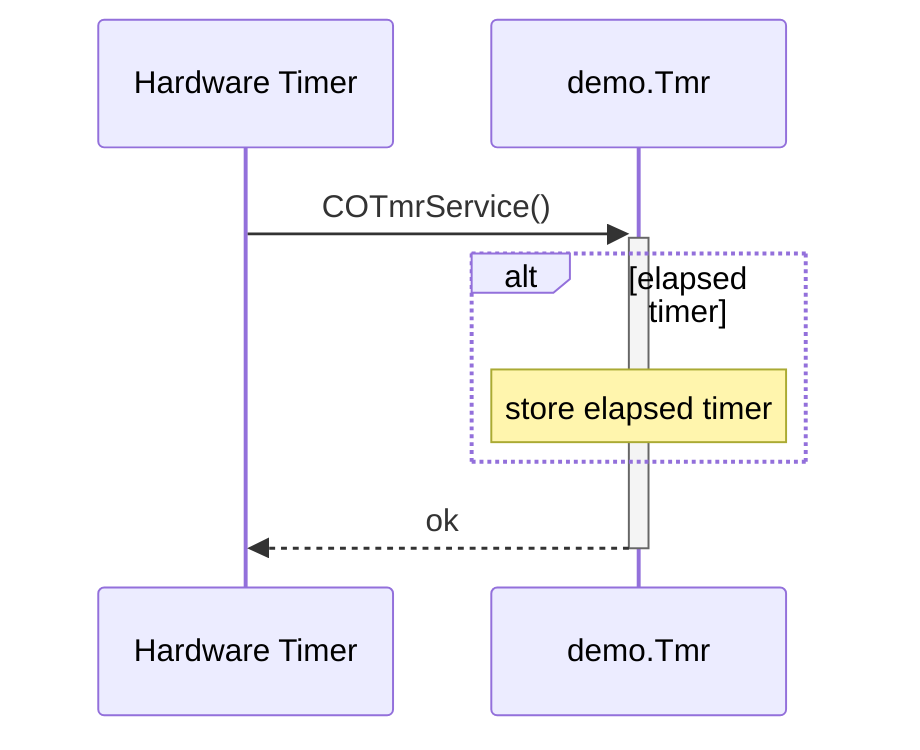
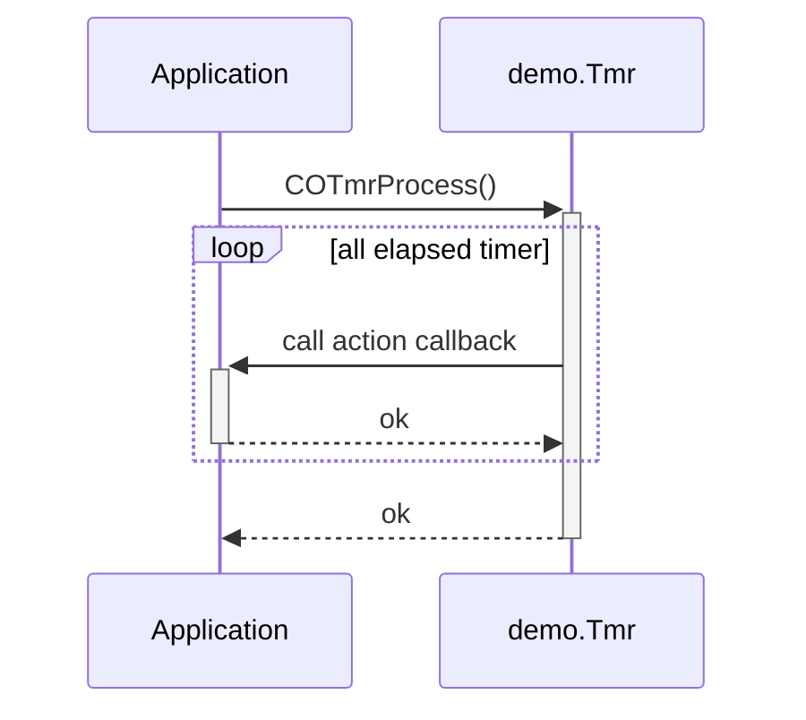

# Timed Actions

## CANopen Timer

The CANopen stack provides service functions for performing timed actions on the application or the profile-specific events. For timed actions the service function group COTmr…() is provided.

### Event Time Base

To establishing a constant time base, the CANopen stack provides a service function. For generating a time base, the following line should be placed in a hardware timer interrupt service function, which is called periodically:

```c
  COTmrService(&demo);    /* trigger time event     */
```

The following diagram shows the internal behavior of this service:



### Action Processing

The CANopen stack handles the storage and order of timed actions internally. For the execution of the timed functions a service function is provided.
For processing the elapsed timer actions, the following line should be placed in a loop within the background function:

```c
  COTmrProcess(&demo);    /* process timed action(s)  */
```

The following diagram shows the internal behavior of this service:



*Note: The CANopen stack uses the timed actions for standardized timed actions. In this case the shown ActionCallback function is an internal CANopen stack function.*
