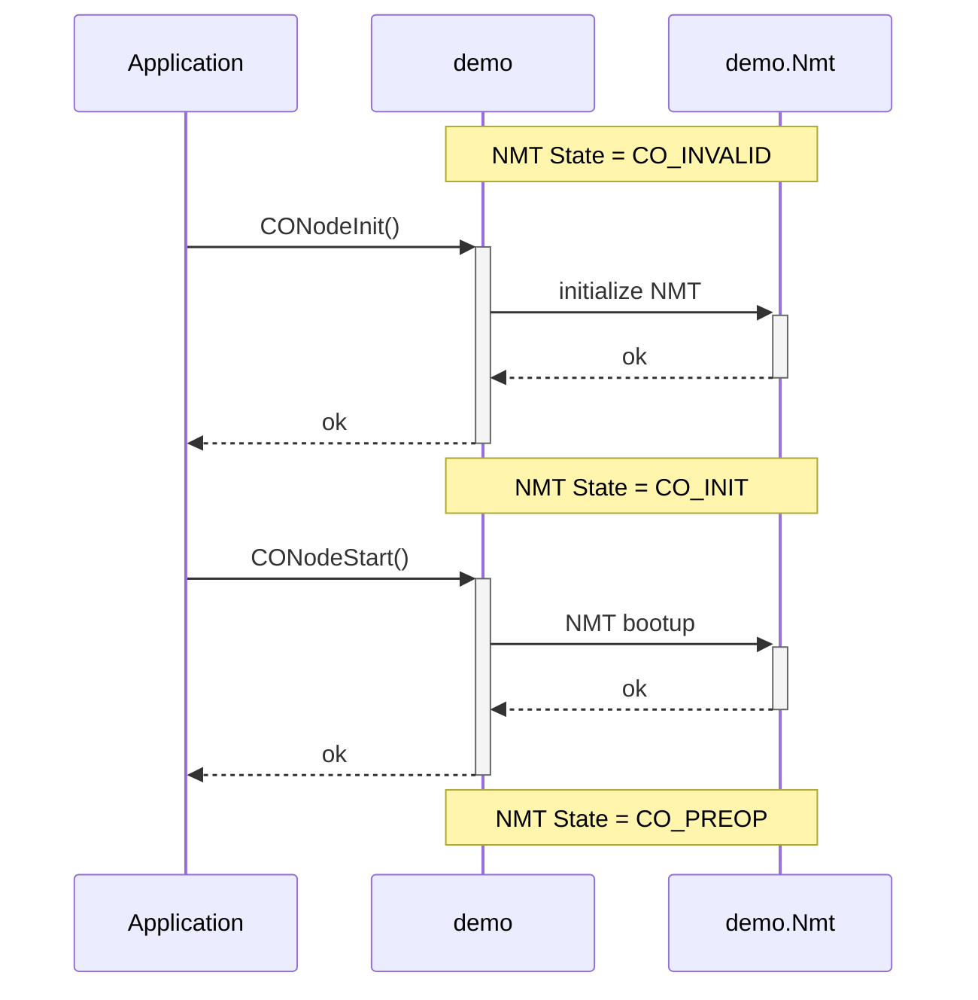
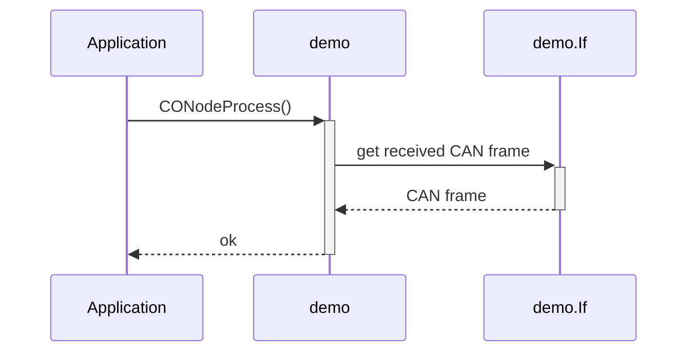
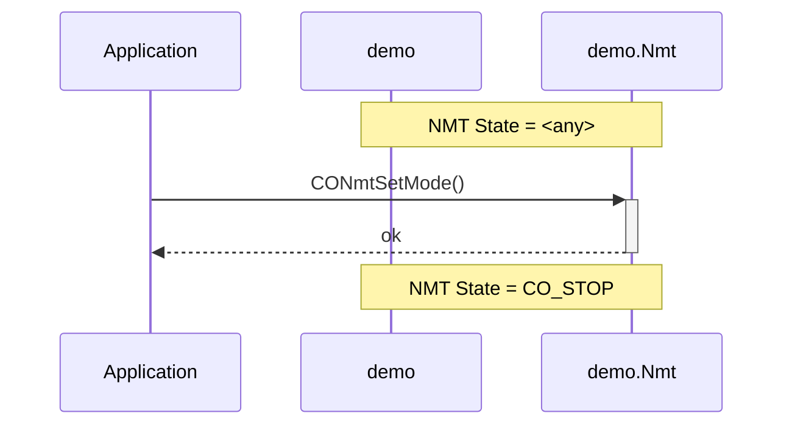
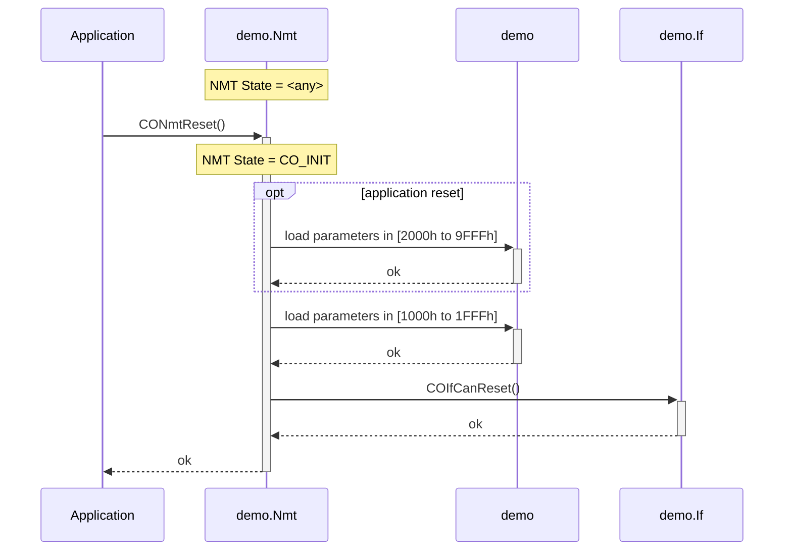
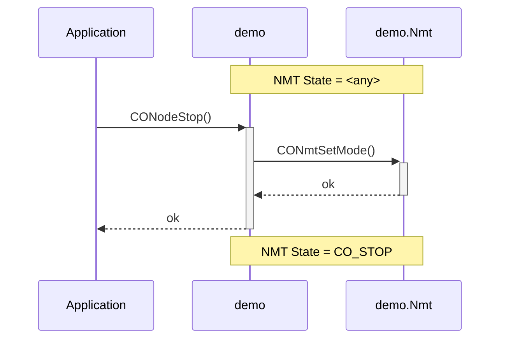

# Controlling the Node

## CANopen Node

The CANopen network is organized in a mix of master/slave and producer/consumer communication architecture. One single CANopen device (a master or a slave) is represented within the software with a data structure, called *node*. This structure is the central entry point of the application into the specific CANopen node.

The following source line is essential to create a new instance of the node:

```c
  CO_NODE demo;   /* create the node instance 'demo' */
```

The service functions starting with `CONode…()` are provided for initializing and controlling the node-specific aspects. These service functions are requesting the corresponding node pointer as the first argument.

For example reading the internal error state of the CANopen Node:

```c
  err = CONodeGetErr(&demo); /* get error state of node 'demo'  */
```

The same naming convention is realized with several modules. The following table shows the names of the provided modules and their corresponding arguments:

| Service Group | Argument   | Example                                      |
| ------------- | ---------- | -------------------------------------------- |
| CODir…()      | &demo.Dir  | `CODirFind(&demo.Dir, CO_DEV(0x1234,0x56));` |
| COEmcy…()     | &demo.Emcy | `COEmcyCnt(&demo.Emcy);`                     |
| COIf…()       | &demo.If   | `COIfCanSend(&demo.If, &frm);`                  |
| CONmt…()      | &demo.Nmt  | `CONmtGetMode(&demo.Nmt);`                   |
| CONode…()     | &demo      | `CONodeGetErr(&demo);`                       |
| COTmr…()      | &demo.Tmr  | `COTmrCreate(&demo.Tmr, 0, 10, MyFunc, 0);`  |
| COTPdo…()     | &demo.TPdo | `COTPdoTrigPdo(&demo.TPdo, 1);`              |


### Node Start

The start of a node needs to have some additional information about memory allocation, the object directory, and more. This information is collected to a single structure, called *node specification*.

The following source lines show a typical node specification:

```c
  const CO_NODE_SPEC DemoSpec = {
    (uint8_t      ) 0x01,              /* pre-defined Node-ID            */
    (uint32_t     ) Baudrate,          /* default baudrate               */
    (CO_OBJ      *)&AppObjDir,         /* start of object directory      */
    (uint16_t     ) APP_OBJ_N,         /* number of objects in directory */
    (CO_EMCY_TBL *)&AppEmcyCode,       /* start of emergency code table  */
    (CO_TMR_MEM  *)&AppTmrMem,         /* start of timer manager memory  */
    (uint16_t     ) APP_TMR_N,         /* max. number of timers/actions  */
    (uint32_t     ) APP_TICKS_PER_SEC, /* timer clock frequency in Hz    */
    (CO_IF_DRV    )&AppDrv,            /* hardware interface drivers     */
    (uint8_t     *)&AppSdoBuf          /* start of SDO transfer buffer   */
};
```

The service function `CONodeInit()` initializes the given node with the data and memory of the given node specification:

```c
  CONodeInit (&demo, (CO_NODE_SPEC *)&DemoSpec);
```

The internal behavior of the CANopen stack is shown in the following diagram:



The CANopen network state machine state is still in `CO_INIT` after the node initialization, because there may be several additional actions necessary before setting the node in the pre-operational state.
With the second function call `CONodeStart()` the bootup message is sent and the node is in pre-operational mode. The node is now able to perform network communications.


### Node Processing

For processing a single CANopen network message, the CANopen stack provides a service function. The following line processes the latest received CAN message:

```c
  CONodeProcess(&demo);
```

The internal behavior of the CANopen stack is shown in the following diagram:




### Node Stop

Stopping a node is typically performed by the CAN network with [autonomous requests](/docs/usecase/overview#autonomous-external-request). Nevertheless, the CANopen stack provides a service function to switch the NMT modes by the application. The following line switches the node into the NMT mode `CO_STOP`.

```c
  CONmtSetMode(&demo.Nmt, CO_STOP);
```

The internal behavior of the CANopen stack is shown in the following diagram:



*Note: After this activity, the interface and all resources are still locked and must not be used by other components.*


### Node Reset

Resetting a node is typically performed by the CANopen master via NMT protocol messages. This is done by the CANopen stack without any necessary actions by the application.

The CANopen stack provides a service function to reset the node by the application. The following line initiates the reset of the node.

```c
  CONmtReset(&demo.Nmt, CO_RESET_NODE);
```

There are two different kinds of resets possible:
- Reset Communication and Application (this is called "Reset Node")
- Reset Communication

The internal behavior of the CANopen stack is shown in the following diagram:




### Node Shutdown

Shutting down a node is typically not used by real embedded CANopen applications. This function is provided to delete all dynamically created objects and free the used memory areas.

```c
  CONodeStop(&demo);
```

The internal behavior of the CANopen stack is shown in the following diagram:



*Note: After this activity, the interface and all resources are free to use by other components.*
