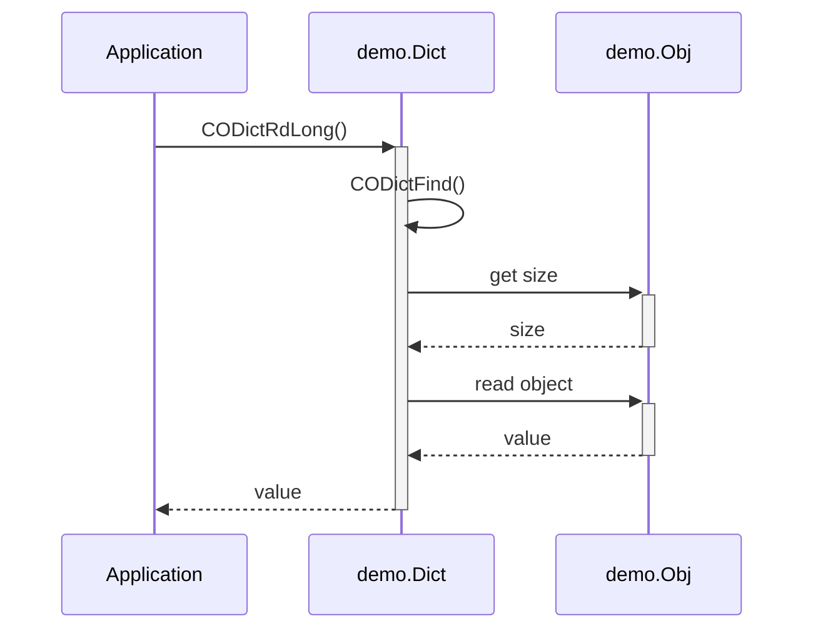
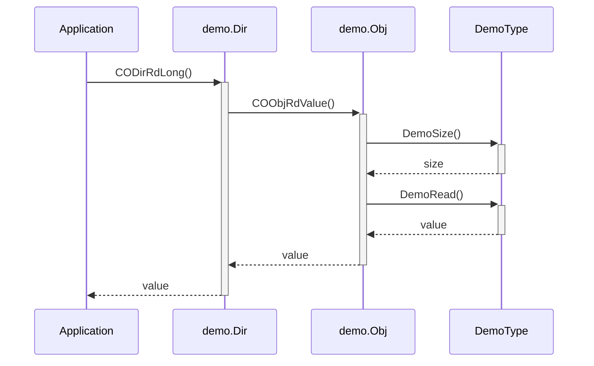

# Using Object Dictionary

## Object Dictionary

The main interface within the CANopen network is the object dictionary of the CANopen nodes. The object dictionary of a node is accessible from the network as well as from the node application.

The definition of the object dictionary table is done with an array of object entries of the type `CO_OBJ`. A small example is shown below:

```c
const CO_OBJ DemoOD[] = {
    :
  /* PDO mappable read-only value: */
  { CO_KEY(0x1001, 0, CO_OBJ____PR_), CO_TUNSIGNED8,  (CO_DATA)(&DemoErrReg) },

  /* Read-only value, which depends on Node-ID: */
  { CO_KEY(0x1014, 0, CO_OBJ__N__R_), CO_TUNSIGNED32, (CO_DATA)(&DemoEmcyId) },

  /* In CO_DATA pointer memory stored constant value: */
  { CO_KEY(0x2400, 0, CO_OBJ_D___R_), CO_TUNSIGNED8,  (CO_DATA)(1)           },

  /* A normal 32bit process data entry: */
  { CO_KEY(0x2400, 1, CO_OBJ_____RW), CO_TUNSIGNED32, (CO_DATA)(&DemoVarLong)},
    :

  /* mark the end of object dictionary: */
  CO_OBJ_DICT_ENDMARK
};
```

!!! warning "Important"

    The CANopen Stack relies on a binary search algorithm to ensure that object dictionary entries are found quickly. Because of this, you must keep the index / subindex of all entries in the object dictionary sorted in ascending order.

!!! note

    The object dictionary can manage different object entry types with different properties. This information is encoded within the [object property flags][1] and the [object type functions][2] and is described in detail in the configuration section.

The update of the provided basic and system object types within the object dictionary is managed by the CANopen stack. The application may read or write these objects at any time. Use the service function groups CODict…() and COObj…() for accessing the object dictionary.

### Basic Objects

The read and write access of basic object entries is symmetrical. Therefore the description is reduced to read access. The data width of basic objects is 8bit (byte), 16bit (word) or 32bit (long). All widths are handled in the same way, therefore the description is reduced to 32bit (long) object entries.

For simple read access of a (hypothetical) 32bit object entry with an index=0x2345 and subindex=0x56, the service call is:

```c
CODictRdLong(&demo.Dict, CO_DEV(0x2345,0x56), &value);
```

The following diagram shows the internal behavior of this service.



For multiple accesses to the same object entry, the following sequence reduces the performance overhead, which is based on searching within the object dictionary. The object read and write functions can take a previously searched object entry as the first argument:

```c
CO_OBJ *obj = CODictFind(&demo.Dict, CO_DEV(0x1234,0x56));

do {
  COObjRdValue(obj, &demo, &value, sizeof(value));
} while (value == 0);
```

### Parameter Objects

The CANopen stack provides service functions, a callback interface and a system object type for managing parameters. The parameters are handled in parameter groups. The parameter group memory must be a consecutive memory area. The recommended way to allocate this memory area is shown in the following example:

```c
struct DEMO_PARA_T {
  uint32_t ParaLong;           /* storable 32bit parameter value */
  uint16_t ParaWord;           /* storable 16bit parameter value */
  uint8_t  ParaByte;           /* storable 8bit parameter value */
} DemoParaMem;
```

The parameter group object holds all necessary information, which are needed for the parameter handling. This structure may be placed into ROM because it holds only constant values.

```c
const CO_PARA {
  0L,                          /* start address in non-volatile memory */
  sizeof(struct DEMO_PARA_T),  /* size of parameter memory */
  &DemoParaMem,                /* start address of parameter memory */
  &DemoParaDef,                /* start address of default parameters */
  CO_RESET_NODE,               /* reset type for reload parameter */
  (void*)"DemoParaId",         /* user parameter identification */
  CO_PARA___E                  /* enable parameter storage on cmd */
} DemoParaObj;
```

If this parameter group is controllable from the CAN network side, the standard parameter save object (and optionally the parameter load object) is placed into the standard defined location of the object dictionary. The following example shows the object entry for *save all parameters*:

```c
const CO_OBJ DemoOD[] = {
    :
  { CO_KEY(0x1010, 1, CO_OBJ_____RW), CO_TPARA_STORE, (CO_DATA)(&DemoParaObj) },
    :
};
```

The parameter values itself can be used within any object directory entry. The following example shows the usage of the demo parameter of the parameter group DemoParaMem within a hypothetical object entry with index 0x2345 and subindex 0x56:

```c
const CO_OBJ DemoOD[] = {
    :
  { CO_KEY(0x2345,0x56, CO_OBJ_____RW), CO_TUNSIGNED32, (CO_DATA)(&(DemoParaMem.ParaLong)) },
  { CO_KEY(0x2345,0x57, CO_OBJ_____RW), CO_TUNSIGNED16, (CO_DATA)(&(DemoParaMem.ParaWord)) },
  { CO_KEY(0x2345,0x58, CO_OBJ_____RW), CO_TUNSIGNED8,  (CO_DATA)(&(DemoParaMem.ParaByte)) },
    :
};
```

If a parameter group must be controllable from the node application side, the API function group COPara…() is provided. The following line stores the given parameter group in NVM.

```c
COParaStore(&DemoParaObj, &demo);    /* store parameter group */
```

The following diagram shows the internal behavior of storing a parameter object:


### Domain Objects

The CANopen stack provides a system object type for managing domains. The domain memory must be a consecutive memory area. The recommended way to allocate this memory area is shown in the following example:

```c
uint8_t DemoDomainMem[DEMO_DOMAIN_SIZE];    /* domain memory area */
```

The domain object holds all necessary information, which is needed for domain handling.

```c
CO_OBJ_DOM DemoDomainObj = {
  0,                     /* variable for read position     */
  DEMO_DOMAIN_SIZE,      /* size of domain memory          */
  &DemoDomainMem[0]      /* start address of domain memory */
};
```

To enable the usage of this domain to the CAN network side, the domain object must be added to the object directory. See the following object entry with index=0x2345 and subindex=0 as an example:

```c
const CO_OBJ DemoOD[] = {
    :
  { CO_KEY(0x2345, 0, CO_OBJ_____RW), CO_TDOMAIN, (CO_DATA)(&DemoDomainObj) },
    :
};
```

### String Objects

The CANopen stack provides a system object type for managing strings. The strings are assumed to be read-only data. The recommended way to allocate this string memory is shown in the following example:

```c
const uint8_t DemoString[] = "Hello World!";    /* string memory */
```

The string object holds all necessary information, which are needed for the string handling.

```c
CO_OBJ_STR DemoStringObj = {
  0,                     /* variable for read position     */
  &DemoString[0]         /* start address of string memory */
};
```

To enable the usage of this string to the CAN network side, the string must be added to the object directory. See the following object entry with index=0x3456 and subindex=0 as an example:

```c
const CO_OBJ DemoOD[] = {
    :
  { CO_KEY(0x3456, 0, CO_OBJ_____R_), CO_TSTRING, (CO_DATA)(&DemoStringObj) },
    :
};
```

### User Objects

User type objects are provided to implement special behavior of read and/or write access to an object entry. The complex system types are using this mechanism to provide the specified behavior of several pre-defined CANopen object entries.

The implemented access functions (called "type functions") are used for any access to the object entry, regardless of the accessing component (CAN network via CAN messages or the application via the API functions).

An example user type (called "DemoType") is declared with the following structure.

```c
CO_OBJ_TYPE DemoType = {
  DemoSize,  /* type function to get object size         */
  DemoInit,  /* type function to initialize type object  */
  DemoRead,  /* type function to read object content     */
  DemoWrite, /* type function to write object content    */
  DemoReset  /* type function to reset the object        */
};
```

If a new user type didn't need to have special behavior on initialization or reset events, the corresponding type function can be set to 0 to ignore potential calls and just return no error.

The following list shows the type function prototypes. The return value of the size type function (e.g. `DemoSize()`) shall return the size of the user type in bytes. The other type functions shall return `CO_ERR_NONE` after the successful operation. If an error is detected the corresponding error codes must be returned: `CO_ERR_TYPE_RD`, `CO_ERR_TYPE_WR`, `CO_ERR_TYPE_INIT`, or `CO_ERR_TYPE_RESET`.

```c
uint32_t DemoSize (CO_OBJ *obj, CO_NODE *node, uint32_t width);
CO_ERR   DemoInit (CO_OBJ *obj, CO_NODE *node);
CO_ERR   DemoRead (CO_OBJ *obj, CO_NODE *node, void *buffer, uint32_t size);
CO_ERR   DemoWrite(CO_OBJ *obj, CO_NODE *node, void *buffer, uint32_t size);
CO_ERR   DemoReset(CO_OBJ *obj, CO_NODE *node, uint32_t para);
```

To enable the usage of this demo type to the CAN network side, the demo object must be added to the object directory. See the following object entry with index=0x6789 and subindex=0 as an example:

```c
#define CO_TDEMO  ((CO_OBJ_TYPE*)&DemoType)

const CO_OBJ DemoOD[] = {
    :
  { CO_KEY(0x6789, 0, CO_OBJ_____RW), CO_TDEMO, (CO_DATA)(&DemoValue) },
    :
};
```

The following diagram shows the internal behavior of read access to the user type object:



#### FAQ

---

**How can I access the object size when implementing a type function?**

*The parameter `size` in the functions `DemoRead()` and `DemoWrite()` is the size of the data, given via the pointer `buffer`. If you want to use the width of the object entry, you can use the following snippet:*

```c
CO_ERR DemoRead(CO_OBJ *obj, CO_NODE *node, void *buffer, uint32_t size)
{
  uint32_t width = COObjGetSize(obj, node, 0);

  /* now you can handle your data with:
  *  - size (number of bytes in buffer)
  *  - width (number of bytes in object entry)
  *  Note: you can trust, that the indicated SDO transfer size (if given)
  *        is equal to the width (checked by the SDO server)
  */
}
```

---

**How can I set a non-standard ABORT codes when implementing a type function?**

*When you need to control the ABORT codes of SDO expedited transfers, you can use the function `COObjTypeUserSDOAbort()` to set a user defined SDO abort code within your type functions:*

```c
CO_ERR DemoWrite(CO_OBJ *obj, CO_NODE *node, void *buffer, uint32_t size)
{
  :
  if (/* your error condition */) {
    /* the given abort code is considered in SDO transfers only! */
    COObjTypeUserSDOAbort(obj, node, 0x12345678);
    return CO_ERR_TYPE_WR;
  }
  :
}
```

---

**How can I use the basic type functions when implemeting a type function?**

*When you want to change the behavior of writing to a basic object entry but keep reading this entry unchanged, you need to implement a type function set with `Size`, `Read`, and `Write`. The `Size` and `Read` type functions can be reused from the standard implementation. In the following example we reuse the `CO_TUNSIGNED32` implementation:*

```c
/* define your new type interface */
const CO_OBJ_TYPE MyType = { MyTypeSize, 0, MyTypeRead, MyTypeWrite };

uint32_t MyTypeSize(CO_OBJ *obj, CO_NODE *node, uint32_t width)
{
  /* get base type and re-use it for the size function */
  const CO_OBJ_TYPE *uint32 = CO_TUNSIGNED32;
  return uint32->Size(obj, node, width);
}

CO_ERR MyTypeRead(CO_OBJ *obj, CO_NODE *node, void *buffer, uint32_t size)
{
  /* get base type and re-use it for the read function */
  const CO_OBJ_TYPE *uint32 = CO_TUNSIGNED32;
  return uint32->Read(obj, node, buffer, size);
}

CO_ERR MyTypeWrite(CO_OBJ *obj, CO_NODE *node, void *buffer, uint32_t size)
{
  /* place here your implementation for the write function */
}
```

---


[1]: /usage/configuration/#property-flags
[2]: /usage/configuration/#object-type-interface
