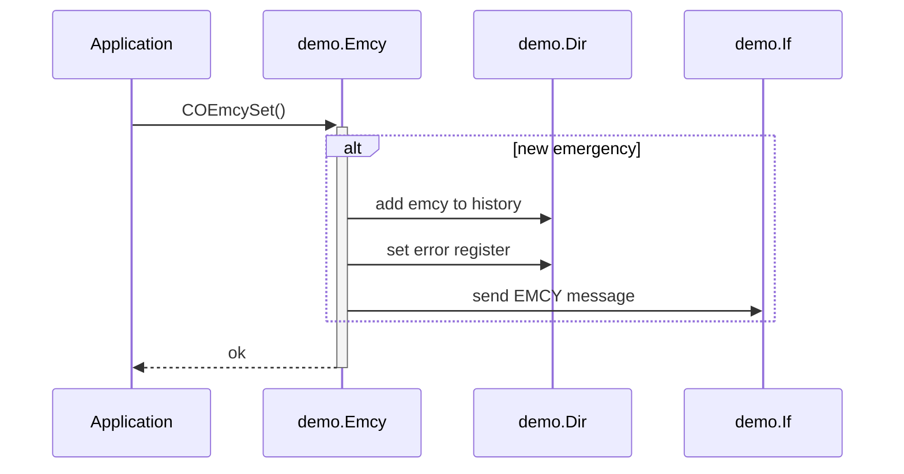

# Emergency Errors

## Managing Emergency Errors

The CANopen stack provides service API functions for managing the emergency events within the application. The handling of EMCY transmission events, the error register and EMCY history management within the object directory is handled within the CANopen stack. For managing the emergency errors the service function group COEmcy…() is provided.


### Emergency Codes

The emergency error codes and the properties of the emergency errors are specified within the configuration. The following example shows the emergency error specification table:

```c
  const CO_EMCY_TBL DemoEmcyCode[CO_EMCY_N] = {
      {  /*--- emercency: #0 -----*/
        CO_EMCY_REG_GENERAL,            /* error register bit    */
        CO_EMCY_CODE_GEN_ERR + 0x0010   /* emergency error code  */
      },
      {  /*--- emercency: #1 -----*/
        CO_EMCY_REG_VOLTAGE,            /* error register bit    */
        CO_EMCY_CODE_VOL_ERR + 0x0001   /* emergency error code  */
      },
       :
  };
```

When using emergency errors, the emergency code is the key for the service functions. Additional to the specific emergency code, user data may be stored or transmitted with each emergency change event. The user data is allocated as a local structure which will be given as a parameter to the service functions. Due to the fact, that the user data for transmission and internal history has different sizes, the following structure is provided for the user data fields:

```c
  CO_EMCY_USR DemoEmcyUsr = {
      0x1234,                            /* 16bit User Data for History  */
      { 0x11, 0x22, 0x33, 0x44, 0x55 }   /* 5byte User Data for EMCY-Msg */
  };
```

*Note: The user data fields for history and/or message can be disabled with two separate configuration settings.*


### Emergency Event

The application can focus on the detection of system situations, which shall rise an emergency event. For setting and clearing an emergency #0 on an application-specific emergency condition, the typical sequence is:

```c
  if (DemoEmcyCondition == TRUE) {
      COEmcySet  (&demo.Emcy, 0, &DemoEmcyUsr);
  } else {
      COEmcyClear(&demo.Emcy, 0);
  }
```

The setting and clearing functions are very similar. Therefore the following diagram shows the internal behavior of the service for setting an emergency error:




### Emergency State

The CANopen stack provides service functions to get internal information of the emergency error management. This simplifies the realization of central error management within the CANopen device.

The following example returns the number of currently active emergency errors:

```c
  num = COEmcyCnt(&demo.Emcy);
```
