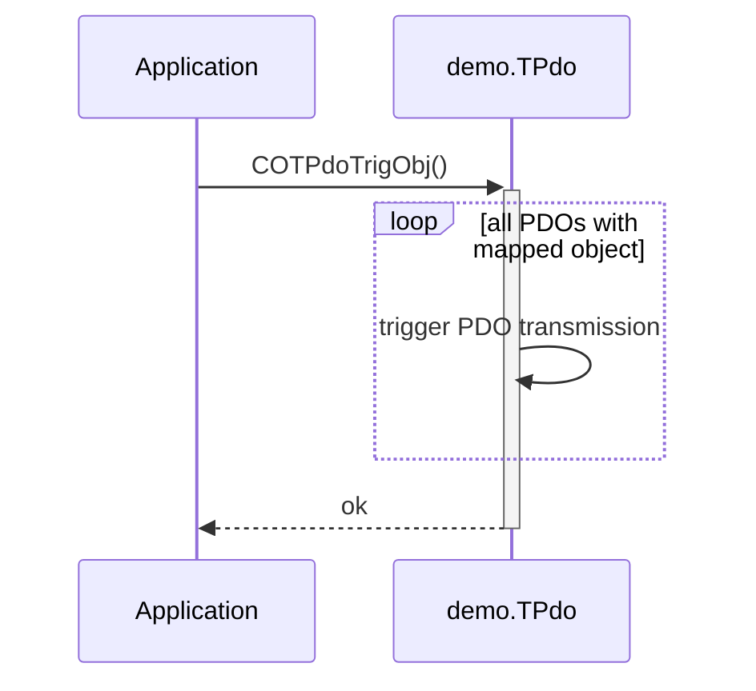

# Transmit PDO

## Triggering PDO Transmission

The CANopen stack provides service functions for triggering PDO transmission on application or profile-specific events. In general, we can trigger the transmission of a PDO in the following ways:


- **Time Trigger** - transmit the configured PDO in a configured time interval

- **Application Trigger** - transmit the given PDO immediatelly

- **Object Trigger** - transmit all PDOs with a configured mapping to a given object entry immediatelly

- **Object Change** - transmit all PDOs with a configured mapping to an object which is marked as asynchronous on changed values

For the detailed object dictionary description for the TPDO communication settings, see [Transmit PDO Communication][1]


### Timer Trigger

For a constant timer based sending as defined in the CiA standards we need to prepare the PDO communication entries accordingly:

```c
  :
{CO_KEY(0x1800, 0, CO_UNSIGNED8 |CO_OBJ_D__R_), 0, (CO_DATA)(5)},
{CO_KEY(0x1800, 1, CO_UNSIGNED32|CO_OBJ_D__R_), 0, (CO_DATA)(CO_COBID_TPDO_DEFAULT(0))},
{CO_KEY(0x1800, 2, CO_UNSIGNED8 |CO_OBJ_D__R_), 0, (CO_DATA)(0xfe)},
{CO_KEY(0x1800, 3, CO_UNSIGNED16|CO_OBJ_D__R_), 0, (CO_DATA)(0)},
{CO_KEY(0x1800, 5, CO_UNSIGNED16|CO_OBJ_D__R_), CO_TEVENT, (CO_DATA)(60)},
  :
```

In this example, the transmission trigger for the TPDO #0 is managed by the stack. The time interval is defined in subindex 5 (in the example 60ms).

### Application Trigger

Transmit with the application API function call is the foundation for other internal possibilities. You may use this in your application, too. For example you can transmit a PDO when a complex logical expression between multiple objects is valid.

```c
COTPdoTrigPdo(&demo.TPdo, 2);      /* trigger TPDO #2 */
```

### Object Trigger

For triggering the transmission of all TPDOs, which has an active mapping entry to a given object directory entry, the service call is:

```c
COTPdoTrigObj(&demo.TPdo, obj);    /* trigger TPDOs via object */
```

The following diagram shows the internal behavior of this service.



### Object Change

The transmit on change of an object entry is described in the quickstart. This transmission is handled by the stack and is configured in the object dictionary:

```c
  :
{CO_KEY(0x1800, 0, CO_UNSIGNED8 |CO_OBJ_D__R_), 0, (CO_DATA)(2)},
{CO_KEY(0x1800, 1, CO_UNSIGNED32|CO_OBJ_D__R_), 0, (CO_DATA)(CO_COBID_TPDO_DEFAULT(0))},
{CO_KEY(0x1800, 2, CO_UNSIGNED8 |CO_OBJ_D__R_), 0, (CO_DATA)(254)},
{CO_KEY(0x1800, 3, CO_UNSIGNED16|CO_OBJ_D__R_), 0, (CO_DATA)(100)},
  :
{CO_KEY(0x1A00, 0, CO_UNSIGNED8 |CO_OBJ_D__R_), 0, (CO_DATA)(1)},
{CO_KEY(0x1A00, 1, CO_UNSIGNED32|CO_OBJ_D__R_), 0, (CO_DATA)(CO_LINK(0x2100, 0x01, 32))},
  :
{CO_KEY(0x2100, 1, CO_UNSIGNED32|CO_OBJ____RW), CO_TASYNC, (CO_DATA)(&MyValue)},
  :
```

This example triggers the transmission of TPDO #0 when the value of the mapped object 2100h:01h is changed by the API function `COObjWrValue()`.

```c
  :
uint32_t  value;
CO_OBJ   *entry;
  :
entry = CODictFind  (&(AppNode.Dict), CO_DEV(0x2100,0x01));
err   = COObjRdValue(entry, &AppNode, &value, sizeof(value), 0);
  :
value++;    /* only a changed value will trigger the PDO transmission! */
  :
err   = COObjWrValue(entry, &AppNode, &value, sizeof(value); 0);
  :
```

!!! note
    When using this mode, the setting of the inhibit time is recommended in case the object changes often (e.g. an unfiltered ADC value). This prohibits the CAN bus from overloaded PDO transmissions. In the example we limit the shortest time between two transmissions to 100 * 100us = 10ms.


## Synchronized communication

Transmit the configured PDO after receiving a configured number of SYNC messages

### SYNC Producer

For triggering the PDO transmissions on all remote nodes in the network, we need to produce the SYNC messages. This CANopen stack supports the generation of SYNC messages by simply adding the following object entries to your object dictionary:

```c
uint32_t obj1005 = CO_SYNC_COBID_ON | 0x80;    /* enable sync producer       */
uint32_t obj1006 = 20 * 1000;                  /* sync cycle-time 20ms in us */
  :
{CO_KEY(0x1005, 0, CO_UNSIGNED32|CO_OBJ____RW), CO_TSYNCID, (CO_DATA)(&obj1005)},
{CO_KEY(0x1006, 0, CO_UNSIGNED32|CO_OBJ____RW), CO_TSYNCCYCLE, (CO_DATA)(&obj1006)},
  :
```

!!! note
    There is only one SYNC producer within the CANopen network allowed. Therefore, you most likely need the dynamic model which allows enabling/disabling of the SYNC producer during the CANopen network configuration process.


### SYNC Consumer

The CiA standard defines synchronous PDO transfers, too. This allows the transmission trigger for the corresponding PDO is activated after the configured number of SYNC messages:

```c
  :
{CO_KEY(0x1807, 0, CO_UNSIGNED8 |CO_OBJ_D__R_), 0, (CO_DATA)(2)},
{CO_KEY(0x1807, 1, CO_UNSIGNED32|CO_OBJ_D__R_), 0, (CO_DATA)(CO_COBID_TPDO_DEFAULT(0))},
{CO_KEY(0x1807, 2, CO_UNSIGNED8 |CO_OBJ_D__R_), 0, (CO_DATA)(0x4)},
  :
```

In this example, the TPDO #7 is triggered after the receiption of every 4-th SYNC message (defined in subindex 2).

!!! note
    The standard entries for subindex 3 and 5 are not used. Therefore, we adjust the highest subindex in object entry with subindex 00h.


[1]: ../configuration#transmit-pdo-communication
